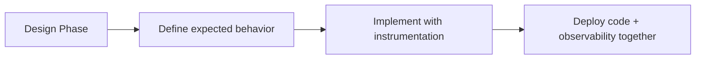
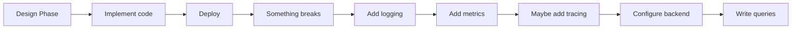
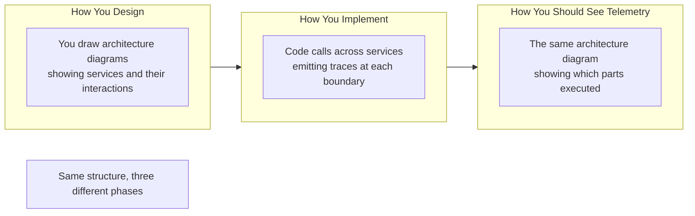
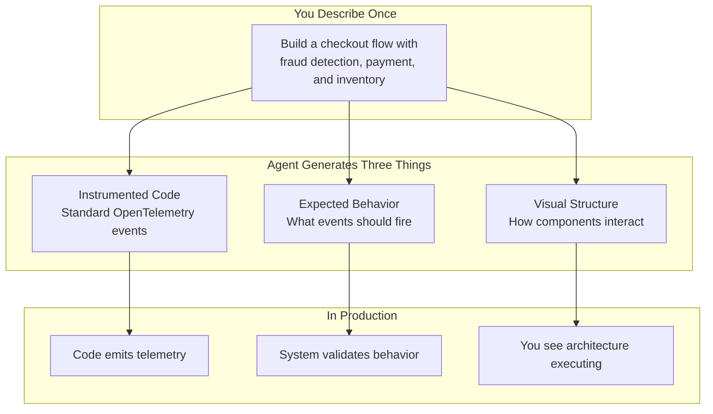
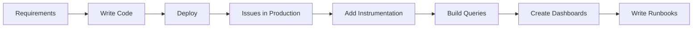
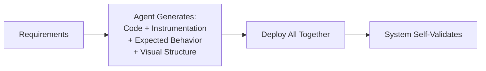

# Agents Made OpenTelemetry Accessible

The observability community got it right. OpenTelemetry is the correct standard. Structured events, distributed tracing, semantic conventions—it's all sound engineering.

The problem was never the approach. It was the cost.

## The Implementation Gap

Proper instrumentation requires two scarce resources:

1. **Engineering expertise** - Someone who understands both your business logic and OpenTelemetry's semantic conventions
2. **Backend infrastructure** - Data pipelines, storage, querying systems to make sense of the telemetry

Most teams have neither. So instrumentation becomes something you bolt on after the fact, if at all.

**Where instrumentation should be:**



**Where instrumentation actually happens:**



The cost pushes instrumentation to the right. It becomes reactive instead of proactive.

## What Agents Change

Agents don't change how observability should work. They remove the barriers that prevented teams from doing it properly.

### Before: High-Cost Instrumentation

When you tell an engineer to build a checkout flow with fraud detection, they implement the logic. Instrumentation? That's a separate effort—if it happens at all.

**Cost:** Specialized expertise, delayed value, reactive implementation

### After: Instrumentation as a Byproduct

When you tell an agent to build the same checkout flow, it generates properly instrumented code from the same requirements.

The agent knows:
- Where to add spans (service boundaries, operations)
- What events to emit (business-significant moments)
- What attributes to capture (context for debugging)

**Cost:** Near zero. Generated from the same description that produces the code.

## The Natural Fit

Instrumentation always belonged in the development phase. You design a feature, you implement it, you define what successful execution looks like—these are the same activity.

But there's another natural fit: **visualization**.

When you design a system, you draw boxes and arrows. "API calls checkout service, checkout calls fraud detection and payment processing." That diagram is how you communicate the design.

**That same diagram is the natural representation of your telemetry structure.**



Your code has structure. Services talk to other services. Telemetry follows that structure. The natural way to see telemetry is the way you designed the system.

## The Disconnect Today

Traditional observability tools show you what happened as data:
- Lists of spans
- Query results
- Time-series graphs

You designed your system as architecture. You think about it visually. But to understand what's happening in production, you translate between two representations.

**What's novel:** Making telemetry look like your architecture, not like a database dump.

When you describe a system to an agent, you're implicitly describing its structure:
- "Checkout service calls fraud detection"
- "Then it processes payment"
- "Then it reserves inventory"

That description contains three things:
1. **What to build** (code)
2. **What should happen** (expected behavior)
3. **How it's structured** (architecture)

Agents can generate all three.

## The Three Artifacts



**Instrumented code** - OpenTelemetry events at the right places
**Expected behavior** - What should happen in successful execution
**Visual structure** - Your architecture as a validation framework

All three from one set of requirements. All three making observability accessible.

## What Makes This Novel

### 1. Instrumentation Becomes Automatic
Not revolutionary—agents just remove the manual cost. The OpenTelemetry approach was always right.

### 2. Expected Behavior Is Defined Upfront
Instead of writing queries to detect problems after they happen, define what success looks like before deployment. The system automatically shows deviations.

### 3. Visualization Matches How You Think
Your architecture diagram isn't decoration. It's the framework telemetry validates against. When something executes, the architecture shows you. When something doesn't execute, the architecture shows you that too.

## The Traditional vs. Agent-Enabled Flow

**Traditional approach:**



**Agent-enabled approach:**



Same end state. Different cost structure.

## What You See: A Simple Example

**Traditional trace view:**
```
Trace ID: 8b3f9a2c
├─ Span: handleCheckout (245ms)
│  ├─ Event: checkout.started
│  ├─ Event: payment.authorized
│  ├─ Event: inventory.reserved
│  └─ Event: checkout.complete
```

Everything looks fine. But fraud check is missing. You'd only know if you remembered it should be there.

**Architecture-based view:**
```
    ┌──────────────┐
    │   Checkout   │ ✅ Executed
    └──────┬───────┘
           │
      ┌────┴────┬────────┬──────────┐
      │         │        │          │
      v         v        v          v
  ┌───────┐ ┌───────┐ ┌────────┐ ┌─────────┐
  │ Fraud │ │ Payment│ │Inventory│ │Complete │
  └───────┘ └───────┘ └────────┘ └─────────┘
      ⚠️        ✅        ✅          ✅
   Missing!
```

The structure shows what didn't happen. You don't search for it. You don't query for it. The architecture makes the absence visible.

## Why This Matters Now

For most of software's history, the person debugging a system was the person who built it. They carried the mental model. That's disappearing.

**84% of developers** now use AI coding tools. **59% ship code** they don't fully understand.

When agent-written code breaks, the engineer investigating didn't write it, didn't design it, and doesn't know what it was supposed to do.

**The solution isn't to slow down code generation.** It's to generate the understanding at the same time as the code.

- Instrumentation documents what the code does
- Expected behavior documents what should happen
- Visual structure documents how it's architected

All three generated automatically. All three making agent-written code observable by default.

## It's Still OpenTelemetry

Nothing about the standard changes:

- ✅ OTLP protocol
- ✅ Spans, events, attributes
- ✅ Semantic conventions
- ✅ Compatible with existing backends

What changes:
- **When** instrumentation happens (during development, not after issues)
- **Who** does it (agents, not specialized engineers)
- **How** you consume it (visual architecture, not just queries)

## What This Means for Teams

**For teams already using OpenTelemetry:**
Keep your approach. The difference is having expected behavior and visual structure that make your telemetry self-documenting.

**For teams not using OpenTelemetry:**
The cost barrier dropped to near-zero. Agents generate properly instrumented code from requirements. Observability by default.

**For teams shipping agent-written code:**
Instrumentation, expected behavior, and architecture all generate automatically. No specialized expertise needed.

**For teams struggling with observability adoption:**
The gap between "we should instrument this" and "we actually instrumented this" was always cost and accessibility. Agents remove the cost. Visualization makes it readable. Together they make OpenTelemetry practical from day one.

## The Core Insight

OpenTelemetry gave us the right approach. Agents make it accessible.

Three things made this possible:

1. **Agents can generate instrumentation** - No specialized expertise required
2. **Requirements implicitly define expected behavior** - Document intent, generate validation
3. **Architecture diagrams map to telemetry structure** - Your design is your observability framework

Together, they solve the cost problem that kept instrumentation reactive and telemetry hard to interpret.

Instrumentation finally fits where it always should have been: part of development, not a specialized discipline that happens later.

Telemetry finally looks how it always should have: like your architecture, not like a database dump.

---

**We're building this.** If you're shipping code (agent-written or not) and want instrumentation to be as automatic as the code itself, let's talk.

principal-ade.com
