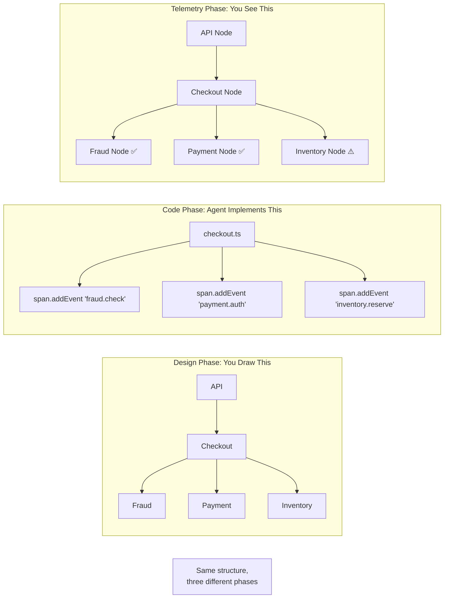
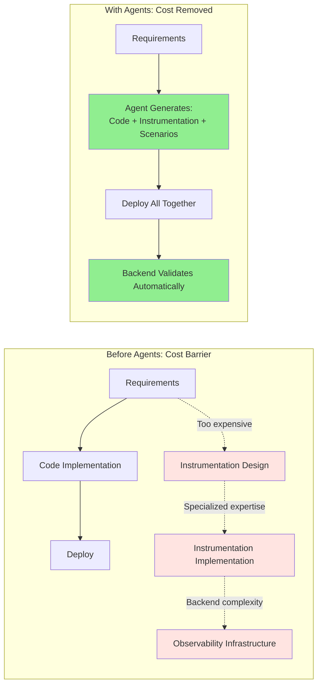
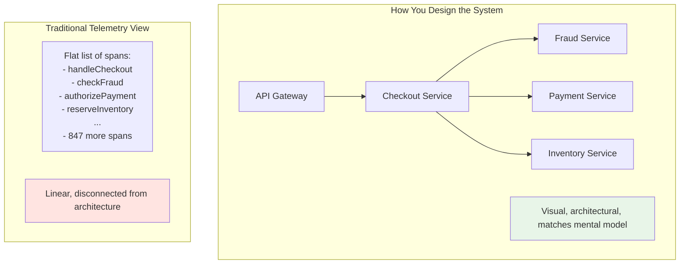
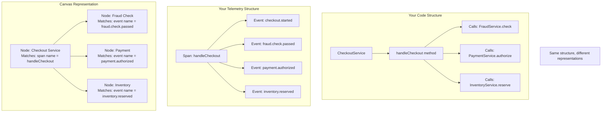
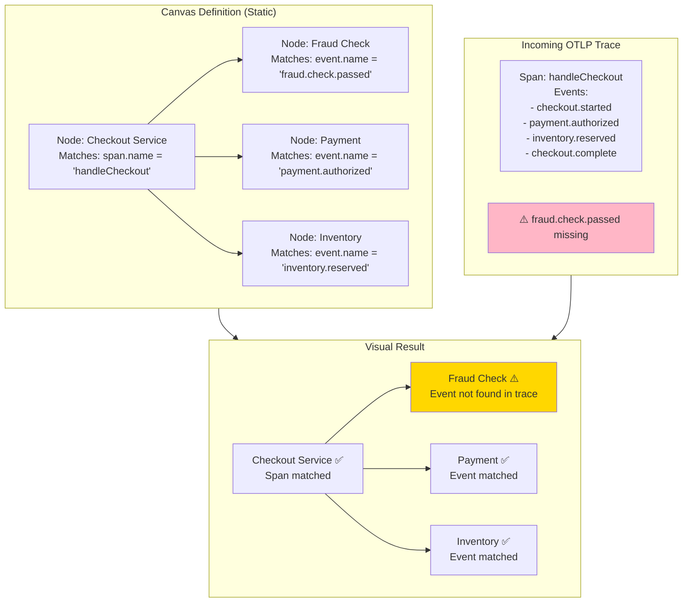
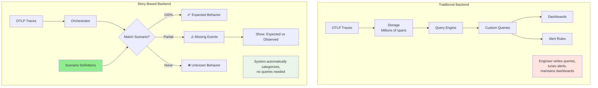
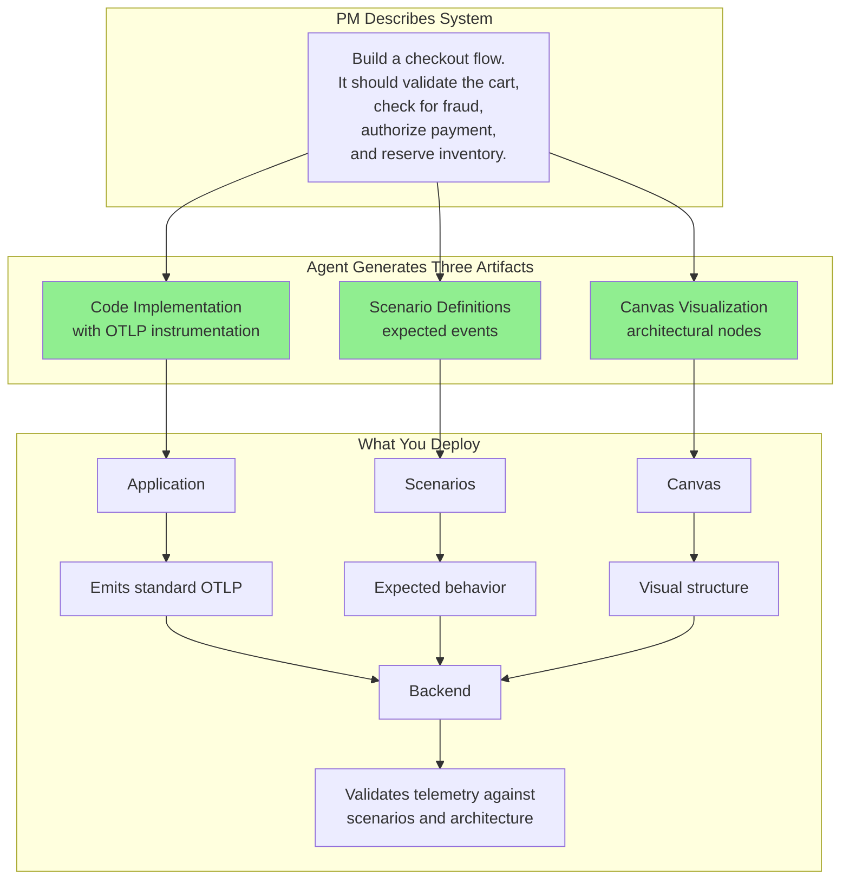
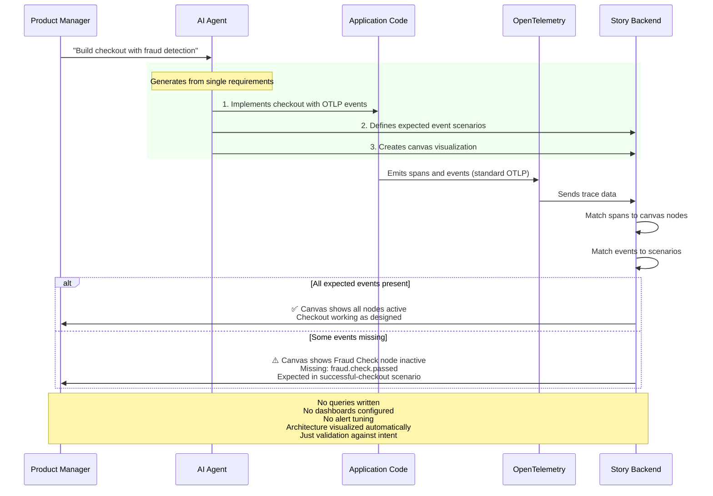
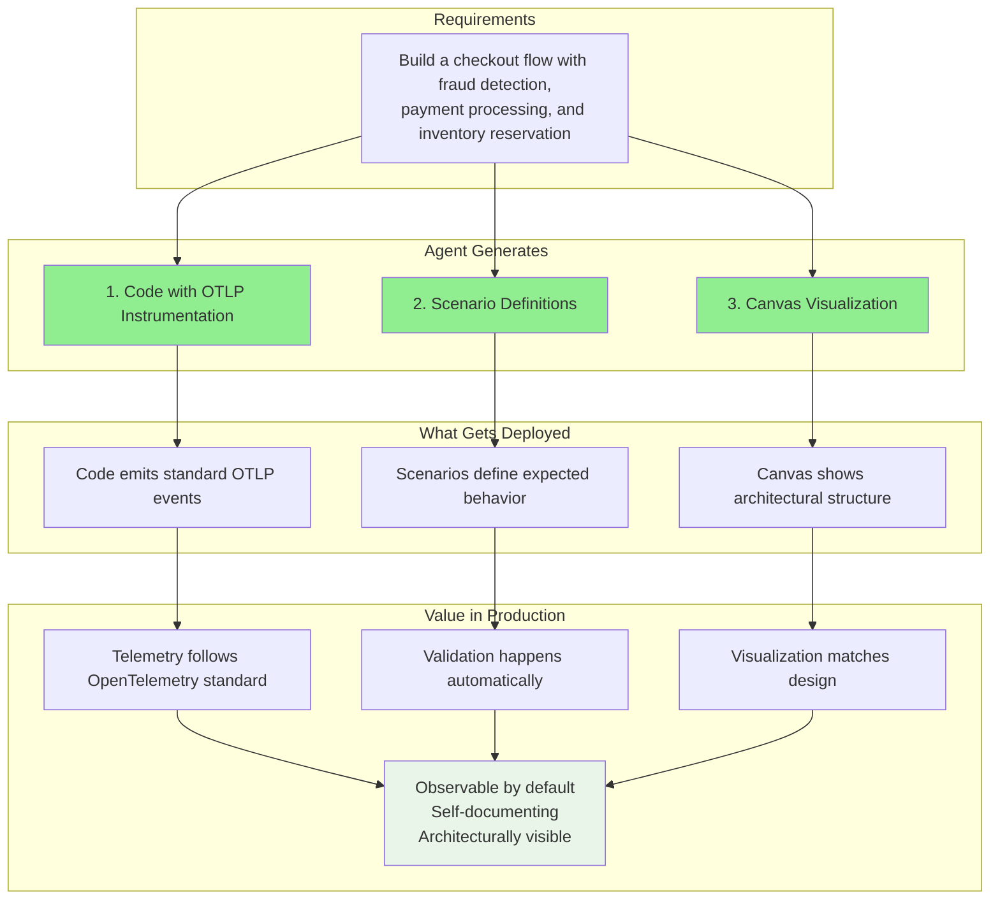

# Agents Made OpenTelemetry Accessible

The observability community got it right. OpenTelemetry is the correct standard. Structured events, distributed tracing, semantic conventions—it's all sound engineering.

The problem was never the approach. It was the cost.

## The Implementation Gap

Proper instrumentation requires two scarce resources:

1. **Engineering expertise** - Someone who understands both your business logic and OpenTelemetry's semantic conventions
2. **Backend infrastructure** - Data pipelines, storage, querying systems to make sense of the telemetry

Most teams have neither. So instrumentation becomes something you bolt on after the fact, if at all.

```mermaid
graph TB
    subgraph Where["Where Instrumentation Should Be"]
        W1[Design Phase] --> W2[Define expected behavior]
        W2 --> W3[Implement with instrumentation]
        W3 --> W4[Deploy code + observability together]

        style W1 fill:#E8F5E8
        style W2 fill:#E8F5E8
        style W3 fill:#E8F5E8
    end

    subgraph Reality["Where Instrumentation Actually Happens"]
        R1[Design Phase] --> R2[Implement code]
        R2 --> R3[Deploy]
        R3 --> R4[Something breaks]
        R4 --> R5[Add logging]
        R5 --> R6[Add metrics]
        R6 --> R7[Maybe add tracing]
        R7 --> R8[Configure backend]
        R8 --> R9[Write queries]

        style R4 fill:#FFB6C6
        style R5 fill:#FFE4E1
        style R6 fill:#FFE4E1
        style R7 fill:#FFE4E1
    end
```



The cost pushes instrumentation to the right. It becomes reactive instead of proactive.

## What Agents Change

Agents don't change how observability should work. They remove the barriers that prevented teams from doing it properly.

### Before: High-Cost Instrumentation

```typescript
// PM requirement:
// "Build a checkout flow with fraud detection"

// Developer implements:
async function handleCheckout(cartId: string) {
  const cart = await validateCart(cartId);
  const fraudResult = await fraudService.check(cartId);
  const payment = await paymentService.authorize(cartId);
  await inventoryService.reserve(cartId);
  return completeCheckout(cartId);
}

// Deployed without instrumentation (too expensive to add upfront)

// Later, after production issues:
// - Observability team adds tracing (3 days)
// - Backend team configures data pipeline (2 days)
// - DevOps writes queries and dashboards (1 day)
// - Total: 6 days of specialized engineering
```

**Cost:** High expertise required, delayed value, reactive implementation

### After: Accessible Instrumentation

```typescript
// Same PM requirement:
// "Build a checkout flow with fraud detection"

// Agent generates properly instrumented code:
async function handleCheckout(cartId: string) {
  const span = tracer.startSpan('handleCheckout');

  span.addEvent('checkout.started', { cartId });

  const cart = await validateCart(cartId);
  span.addEvent('cart.validated', { items: cart.items.length });

  const fraudResult = await fraudService.check(cartId);
  span.addEvent('fraud.check.passed', {
    score: fraudResult.score,
    riskLevel: fraudResult.riskLevel
  });

  const payment = await paymentService.authorize(cartId);
  span.addEvent('payment.authorized', {
    amount: payment.total,
    method: payment.method
  });

  await inventoryService.reserve(cartId);
  span.addEvent('inventory.reserved');

  span.addEvent('checkout.complete', { orderId: payment.orderId });
  span.end();

  return completeCheckout(cartId);
}

// Agent also generates expected behavior definition:
{
  "scenarios": [{
    "id": "successful-checkout",
    "events": {
      "checkout.started": "Cart validation began",
      "cart.validated": "Cart validated successfully",
      "fraud.check.passed": "Fraud check completed",
      "payment.authorized": "Payment processed",
      "inventory.reserved": "Items reserved",
      "checkout.complete": "Order confirmed"
    }
  }]
}

// Deployed together, day one
// Backend automatically validates observed vs expected events
```

**Cost:** Near zero. Generated from the same requirements that produce the code.

## The Natural Fit

Instrumentation always belonged in the development phase. You design a feature, you implement it, you define what successful execution looks like—these are the same activity.

But there's another natural fit: **visualization**.

When you design a system, you draw boxes and arrows. "Checkout service calls payment service calls fraud detection." That diagram is how you communicate the design.

That same diagram is the natural representation of your telemetry structure.



The visualization isn't a "nice-to-have" dashboard feature. It's the architectural blueprint. The telemetry flows through the structure you designed. Showing that structure visually is just showing what already exists.

The only reason it didn't happen there was cost.



| Barrier | Before Agents | With Agents |
|---------|--------------|-------------|
| **OpenTelemetry expertise** | Required specialized knowledge | Agent handles semantic conventions |
| **Instrumentation design** | Manual effort, easy to defer | Generated from requirements |
| **Implementation cost** | Hours per feature | Seconds (part of code generation) |
| **Backend data wrangling** | Complex queries, custom dashboards | Structured validation against scenarios |
| **When it happens** | After problems occur (reactive) | During development (proactive) |
| **Coverage** | Spotty (only critical paths) | Complete (every feature) |

## It's Still OpenTelemetry

Nothing about the underlying approach changes:

- ✅ Standard OTLP protocol
- ✅ Spans, events, attributes following semantic conventions
- ✅ Distributed tracing across services
- ✅ Compatible with existing backends (Jaeger, Tempo, etc.)

What changes is **who does the work** and **when it happens**.

**Before:** Specialized engineers add instrumentation reactively, after deployment.

**After:** Agents generate instrumentation proactively, during development.

And what changes is **how you see it**.

**Before:** Flat lists, nested trees, query results that require translation from "what the backend shows me" to "what my system is doing."

**After:** Visual architecture that matches how you designed the system, with telemetry flowing through it.

## The Visualization Problem

Your code has structure. Services talk to other services. Operations call other operations. You design systems with architecture diagrams because that's how you think about them.

But when you open a traditional observability backend, that structure disappears:



The telemetry **follows** your code structure. A span for the checkout service. A span for the fraud check. A span for payment processing. But the visualization doesn't.

You end up translating between two representations:
- **How you think about the system** (visual, architectural)
- **How you see telemetry** (lists, trees, queries)

That translation is manual work.

## Canvas: Structure as Visualization

Your code's architecture is the natural way to represent telemetry structure. Not because it's prettier, but because they're the same thing.



A canvas is just a visual map of your system where each node knows how to match incoming telemetry. When a trace arrives:

1. **Spans match to nodes** - "This span is the Checkout Service"
2. **Events light up the flow** - "Fraud check happened, payment happened"
3. **Missing events are visible** - "Inventory node didn't light up—why?"

The visualization isn't decoration. It's the architectural blueprint that telemetry validates against.

### Canvas Example

```json
{
  "nodes": [
    {
      "id": "checkout-service",
      "label": "Checkout Service",
      "position": { "x": 100, "y": 100 },
      "spanMatch": {
        "name": "handleCheckout",
        "kind": "SPAN_KIND_SERVER"
      }
    },
    {
      "id": "fraud-check",
      "label": "Fraud Detection",
      "position": { "x": 300, "y": 100 },
      "spanMatch": {
        "event": { "name": "fraud.check.passed" }
      }
    },
    {
      "id": "payment",
      "label": "Payment Processing",
      "position": { "x": 300, "y": 200 },
      "spanMatch": {
        "event": { "name": "payment.authorized" }
      }
    }
  ],
  "edges": [
    { "from": "checkout-service", "to": "fraud-check" },
    { "from": "checkout-service", "to": "payment" }
  ]
}
```

This is your system's architecture, expressed in a format that telemetry can be matched against.

### What You See

**Traditional trace view:**
```
Trace ID: 8b3f9a2c
├─ Span: handleCheckout (245ms)
│  ├─ Event: checkout.started (t=0ms)
│  ├─ Event: payment.authorized (t=89ms)
│  ├─ Event: inventory.reserved (t=112ms)
│  └─ Event: checkout.complete (t=203ms)
```

You have to notice `fraud.check.passed` is missing. You have to remember it should be there.

**Canvas view:**
```
┌─────────────────────┐
│  Checkout Service   │ ✅ Matched
│  handleCheckout     │
└──────┬───────┬──────┘
       │       │
       v       v
┌──────────┐ ┌──────────┐
│  Fraud   │ │ Payment  │
│  Check   │ │ Service  │
└──────────┘ └──────────┘
     ⚠️            ✅
  Missing!     Matched
```

The architecture shows you what's missing. The canvas is both the design document and the validation framework.

### How Canvas + Telemetry Works Together



Your canvas is your architecture. Your telemetry validates whether the architecture executed as designed. The visual representation is just showing what's actually happening.

## The Backend Simplification

The second cost was backend complexity. Even with perfect instrumentation, you still needed to:

1. Ingest massive volumes of trace data
2. Build queries to correlate events
3. Create dashboards to visualize patterns
4. Write alert rules for anomalies
5. Maintain all of the above as the system evolves

Story-based monitoring simplifies this by adding structure to how you consume the telemetry—both through scenarios (expected behavior) and canvas (architectural visualization):



The instrumentation is the same. The backend just has a blueprint (scenarios) to validate against, instead of requiring manual query construction.

## Agents Generate the Visual Structure Too

Here's where it gets interesting. The same agent that generates your code can generate the canvas.

When you describe your system's requirements, you're implicitly describing its architecture:
- "Checkout service calls fraud detection"
- "Then it processes payment"
- "Then it reserves inventory"

That description contains the visual structure.



**Code** tells the system what to do.
**Scenarios** tell the system what should happen.
**Canvas** tells the system how it's structured.

All three from the same requirements. All three generated automatically. All three deployed together.

## The Complete Picture



The canvas isn't something you draw by hand. It's a byproduct of describing what you want to build.

## What This Means for Teams

**For teams already using OpenTelemetry:**
You don't need to change your approach. Story-based monitoring consumes standard OTLP data. The difference is having scenario definitions and visual canvas that make the data self-documenting. Your telemetry structure becomes visible as architecture, not just queryable as data.

**For teams not using OpenTelemetry:**
The cost barrier just dropped to near-zero. Agents can generate properly instrumented code from your requirements. You get observability by default, not as an afterthought. And you get it represented the way you designed it—visually.

**For teams shipping agent-written code:**
Instrumentation becomes automatic. The agent that writes your code can instrument it correctly at the same time. The agent can also generate the architectural canvas from the same requirements. No specialized expertise needed. No manual diagram maintenance.

**For teams struggling with observability adoption:**
The gap between "we should instrument this" and "we actually instrumented this" was always about cost and accessibility. Visualization makes telemetry readable. Agents make instrumentation effortless. Both together make OpenTelemetry practical for every team, every feature, from day one.

## The Three Pieces That Make It Work

This approach rests on three complementary pieces, all generated from the same requirements:



**Code with instrumentation** - Standard OpenTelemetry events at the right places
**Scenario definitions** - What should happen (expected event patterns)
**Canvas visualization** - How the system is structured (architectural map)

All three from one set of requirements. All three making OpenTelemetry accessible.

## The Shift

This isn't about changing how observability works. It's about making the right way accessible.

OpenTelemetry gave us the standard—proper instrumentation with structured events. But the cost was too high for most teams.

**Agents remove the cost** by generating instrumentation from requirements.

**Scenarios remove the query complexity** by defining expected behavior upfront.

**Canvas removes the translation burden** by showing telemetry in the same visual structure you designed.

Together, they make it practical to implement the OpenTelemetry standard from day one, for every feature, without specialized expertise or backend complexity.

Instrumentation finally fits where it always should have been: part of development, not a specialized discipline that happens later. And telemetry finally looks how it always should have: like your architecture, not like a database dump.

---

**We're building this.** If you're shipping code (agent-written or not) and want instrumentation to be as automatic as the code itself, let's talk.

principal-ade.com
