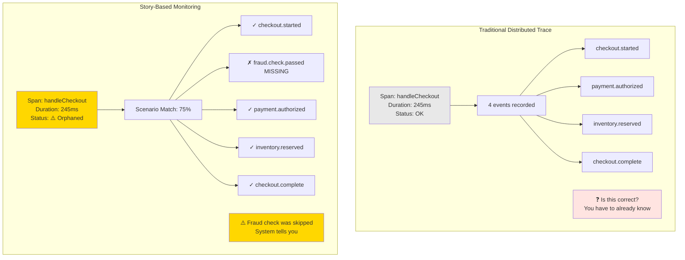
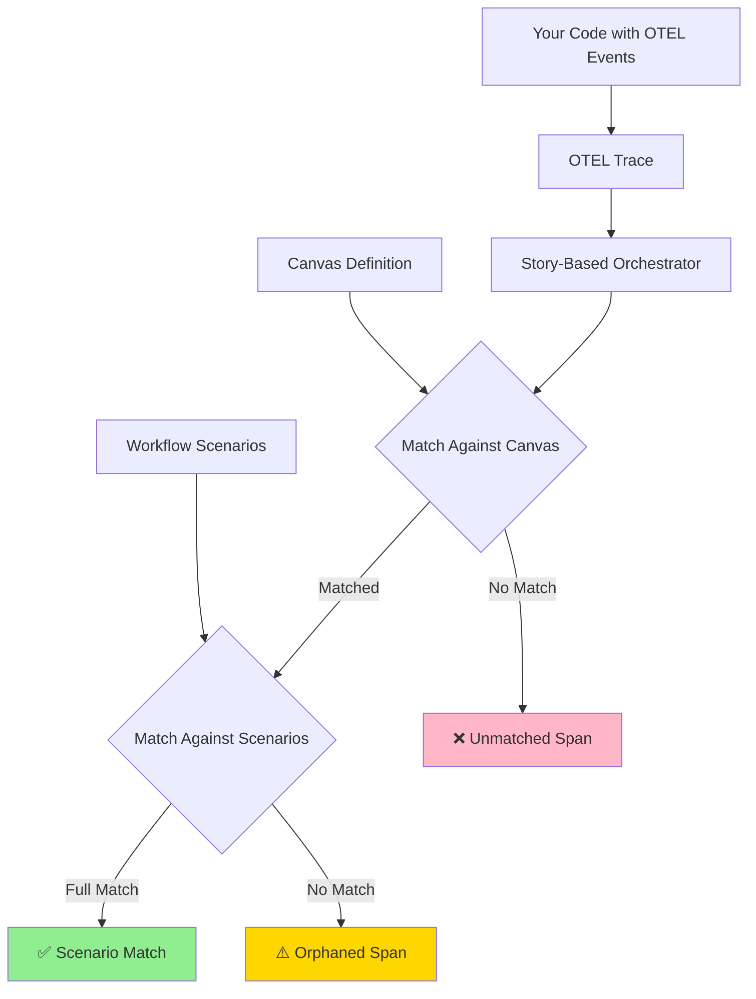
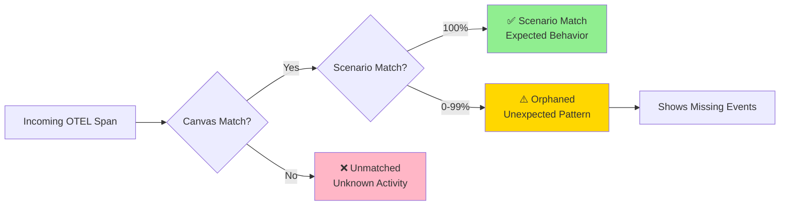
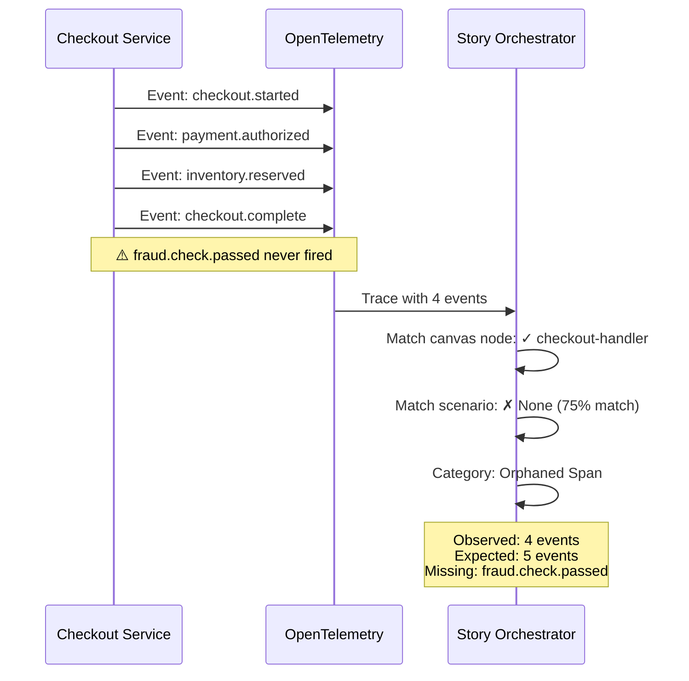
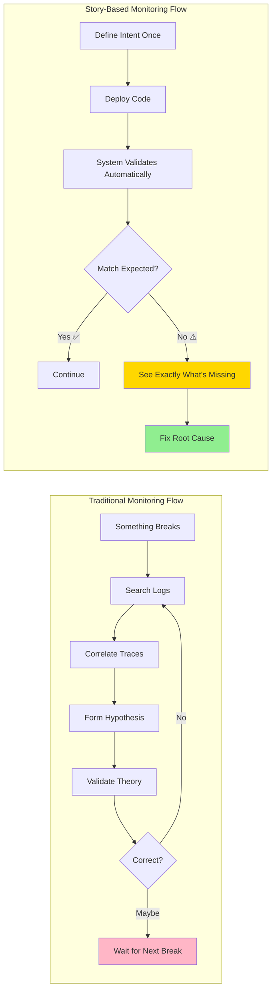

# What Story-Based Monitoring Actually Looks Like

We've spent a lot of words on why monitoring starts from the wrong end. Some like to refer to this messaging as shifting left, and they tend to phrase it as an organizational problem.

Our understanding of the issue is that it was a complexity issue. Adding telemetry to code is not a trivial process. It requires you to have two things at your disposal. An engineer that is well versed in implementing telemetry, and a ui to construct the telemetry you need.

It has great returns if it can be accomplished but developer experience is really hard to calculate roi for.

Agent experience however is something worth improving because there is a direct correlation between the agentic developer experience and how much it costs you to produce code.

There is the added emergent behavior we are seeing in that we can trust agents to write software. This leaves us squarely in the position where, observability is likely the only insight you have to a system in production as agentic adoption increases, and therefore becoming a higher priority.

## What you see today

Take a checkout flow. Six services. Cart validation, payment processing, fraud check, inventory, shipping, confirmation. The kind of thing that keeps the lights on.

Something goes wrong. You open your monitoring dashboard. Five thousand log lines from the last hour across six services. You search for payment_error. Two hundred results. You start correlating timestamps. You open traces. You cross-reference spans.

And we would like to think we are exaggerating this experience but for a large majority of software this is a reality. There is tools that you can use to improve this experience of searching through a haystack, but it is still searching through a haystack.

After Forty-five minutes of mindnumbing exploration, you have a theory of what happened, maybe.

Maybe you're right. Maybe you missed something three services deep. You won't know for sure until it breaks again.

This is the loop most engineering teams live inside. Something breaks. You investigate. You reconstruct. The tools have gotten faster over the years. Smarter, even. The loop itself hasn't changed since the first person wrote the first log statement and hoped it would be enough.

## What you see with story-based monitoring

Every trace is a story. Your software probably isn't incredibly dynamic. There is a set of scenarios you planned for.

You open the monitoring dashboard. One trace. One view:

```
Scenario: "successful-checkout" (75% match) ⚠️

✓ checkout.started - Cart validation began
✗ fraud.check.passed - Missing
✓ payment.authorized - Payment processed
✓ inventory.reserved - Items reserved
✓ checkout.complete - Order confirmed

Status: Orphaned - Expected scenario incomplete
Missing: fraud.check.passed
```

You didn't search for it. You didn't write a query. You didn't even know to look for it. The system knew `fraud.check.passed` was supposed to fire because your scenario defined it before the code ever ran. When that event didn't appear in the trace, the story showed you exactly what was missing.

That's the whole debug session. Under a minute.

Not because the tools got faster at searching. Because there was nothing to search. The answer was in the structure before the first request came through.

## What makes this different from testing

A test asks a narrow question. Does this function return the right value for this input?

A story asks a wider one. Did this entire flow, end to end, in production, with real users and real data, behave the way we intended?

Here's why the checkout bug slips through tests:

```typescript
// Your test
test('checkout completes successfully', async () => {
  const result = await handleCheckout('cart-123');

  expect(result.status).toBe('complete');
  expect(result.orderId).toBeDefined();
  expect(result.payment.authorized).toBe(true);
  // ✅ Test passes
});
```

The test validates that checkout returns the right shape. It doesn't validate that every step in the business process occurred. The fraud check could be completely bypassed, and as long as the checkout completes and returns the expected structure, the test passes.

In production, with story-based monitoring:

```
Request #847 - Customer ID: premium_customer_01
Status: ⚠️ Orphaned Span (80% scenario match)

Expected: successful-checkout scenario
Missing event: fraud.check.passed

Timeline:
09:23:41.001 - checkout.started
09:23:41.089 - payment.authorized  ← Fraud check was skipped
09:23:41.112 - inventory.reserved
09:23:41.203 - checkout.complete
```

Tests run before deployment with synthetic data. Stories run during execution with real user behavior. Tests verify that code is correct. Stories verify that behavior matches intent.

The story caught what the test couldn't. A critical step was missing in production.

## What makes this different from tracing

A distributed trace is a remarkable piece of engineering. Every span, every service call, every duration, laid out across time. It shows you, in extraordinary detail, what happened.

A story shows you what happened next to what should have happened.

Here's the same problematic checkout viewed through both lenses:



In the traditional trace, everything looks fine. The span completed successfully. All recorded events are present. Nothing appears broken. The fraud check event is simply absent. And in a trace with hundreds of events across a busy system, you would never notice one missing unless you already knew to look for it.

That's the problem, really. You have to already know the question.

Stories surface the absence. They can tell you about the thing that didn't happen. Logs can't do that. Traces can't do that. Not because they're bad tools. Because they were built to record what occurred, not to notice what didn't.

Even the most sophisticated query engine in the world can't help you here. You can slice your data by any dimension, with all the cardinality you want. You still can't write a query for something you don't know is missing. Somebody, or something, has to know what was supposed to happen in the first place.

## How it actually works

The system operates on a three-layer architecture that sits on top of your existing OpenTelemetry instrumentation:



**Layer 1: Canvas** - Define your system's visual structure
A canvas file maps your architecture. Each node has matching criteria for incoming OpenTelemetry spans:

```typescript
// checkout-flow.otel.canvas
{
  nodes: [
    {
      id: 'checkout-handler',
      label: 'Checkout Service',
      spanMatch: {
        name: 'handleCheckout',
        kind: 'SPAN_KIND_SERVER',
        attributes: { 'service.name': 'checkout-api' }
      }
    }
  ]
}
```

**Layer 2: Workflows & Scenarios** - Define expected execution patterns
A workflow references a canvas and contains multiple scenarios representing different outcomes:

```typescript
// checkout-flow.workflow.json
{
  canvas: "checkout-flow.otel.canvas",
  scenarios: [
    {
      id: "successful-checkout",
      priority: 1,
      description: "Standard successful checkout",
      template: {
        events: {
          "checkout.started": "Cart validation began",
          "fraud.check.passed": "Fraud check completed",
          "payment.authorized": "Payment processed",
          "inventory.reserved": "Items reserved",
          "checkout.complete": "Order confirmed"
        }
      }
    },
    {
      id: "payment-declined",
      priority: 2,
      template: {
        events: {
          "checkout.started": "Cart validation began",
          "fraud.check.passed": "Fraud check completed",
          "payment.declined": "Payment was declined",
          "checkout.failed": "Checkout abandoned"
        }
      }
    }
  ]
}
```

**Layer 3: Real-time Matching** - Categorize every trace
When an OpenTelemetry trace arrives, the orchestrator categorizes each span into one of three buckets:



### The Three Categories

**✅ Scenario Match** - Everything as expected
- Canvas node matched (we know what component executed)
- Scenario matched at 100% (all required events present)
- Example: `['checkout.started', 'fraud.check.passed', 'payment.authorized', 'inventory.reserved', 'checkout.complete']`

**⚠️ Orphaned Span** - Something unexpected happened
- Canvas node matched (we know what component executed)
- No scenario matched at 100%
- The system records:
  - **Observed events:** What actually happened
  - **Expected events:** What should have happened for any scenario to match
  - **Missing events:** The gap between observed and expected
- Example: Observed `['checkout.started', 'payment.authorized', 'checkout.complete']` but expected `fraud.check.passed` event is missing

**❌ Unmatched Span** - Completely unknown activity
- No canvas node matched this span
- Could indicate new code paths, misconfigured instrumentation, or unexpected service behavior

### A Concrete Example

Here's what the system sees when a checkout is missing the fraud check:



The key insight: Your code emits events as it executes. The system compares those events against your pre-defined scenarios in real-time. When the pattern doesn't match, you immediately see what was supposed to happen but didn't.

### From Intent to Insight: The Complete Flow

Let's walk through what this looks like in practice:

**Step 1: Instrument your code** (standard OpenTelemetry)
```typescript
async function handleCheckout(cartId: string) {
  const span = tracer.startSpan('handleCheckout');

  span.addEvent('checkout.started', { cartId });

  // Fraud check happens here
  const fraudResult = await fraudService.check(cartId);
  if (fraudResult.passed) {
    span.addEvent('fraud.check.passed', { score: fraudResult.score });
  }

  const payment = await paymentService.authorize(cartId);
  span.addEvent('payment.authorized', { amount: payment.total });

  await inventoryService.reserve(cartId);
  span.addEvent('inventory.reserved');

  span.addEvent('checkout.complete', { orderId: payment.orderId });
  span.end();
}
```

**Step 2: Define your expected scenarios** (once, upfront)
```json
{
  "scenarios": [
    {
      "id": "successful-checkout",
      "description": "Standard successful checkout flow",
      "template": {
        "events": {
          "checkout.started": "Cart validation began",
          "fraud.check.passed": "Fraud check completed",
          "payment.authorized": "Payment processed",
          "inventory.reserved": "Items reserved",
          "checkout.complete": "Order confirmed"
        }
      }
    }
  ]
}
```

**Step 3: Deploy and run** (the system handles everything else)

When production traffic flows through, you get automatic categorization:

| Request | Scenario Match | Status | What You See |
|---------|---------------|--------|--------------|
| Request #1 | 100% | ✅ | All expected events present |
| Request #2 | 75% | ⚠️ | Missing: `fraud.check.passed` |
| Request #3 | 100% | ✅ | All expected events present |
| Request #4 | 80% | ⚠️ | Missing: `inventory.reserved` |

You don't write queries. You don't set up alerts. You don't search logs. The system automatically surfaces any execution that doesn't match your defined scenarios, showing you exactly which events were expected but didn't occur.

## Why this matters more now

For most of the history of software, the person debugging a system was the person who built it. They carried the intent in their head. They knew what was supposed to happen because they were the ones who made it happen. That knowledge, that context, was the invisible scaffolding that made every monitoring tool usable.

That scaffolding is disappearing.

84% of developers now use AI coding tools. 59% ship code they don't fully understand. The person on call at 3am increasingly didn't write what broke, didn't review what shipped, and doesn't hold the mental model of how the system is supposed to behave.

The speed of delivery has exploded. The speed of understanding has not kept up. The industry is calling it comprehension debt, and every team shipping agent-written code is accumulating it whether they've named it yet or not.

Organizations used to be limited by how fast they could deliver. Now they're limited by how fast they can validate and understand what they delivered.

### The Mental Model Shift



|  | Traditional Monitoring | Story-Based Monitoring |
|---|---|---|
| **Starting Point** | Data (what happened) | Intent (what should happen) |
| **Detection** | Reactive - something must break | Proactive - deviation from expected |
| **Investigation** | Search, correlate, reconstruct | Read the diff between expected and actual |
| **Knowledge Required** | Must know what to look for | System knows what to look for |
| **Time to Answer** | Minutes to hours | Seconds |
| **Missing Events** | Invisible unless you know to look | Automatically surfaced |
| **Mental Model** | Archaeologist reconstructing the past | Inspector validating against blueprint |

## The pattern

Say what should happen. Run the code. Read the story.

The concept is simple. The engineering underneath is not, which is why we have seven patents filed. But from the developer's perspective, it's three steps. Say it. Run it. Read it.

The work changes. Instead of searching through what happened, you read whether what happened matched what you intended. Archaeology becomes inspection. Reconstruction becomes validation. The forty-five minute investigation becomes a one-minute read.

We think that's where monitoring has to go. Not faster investigation. Not smarter queries. Not AI reading your logs for you. A different starting point. Intent first. Data second.

We're building it. We're in alpha. We're looking for engineering teams who feel this gap every day. If your team is shipping agent-written code to production and the distance between what your system does and what you believe it does keeps growing, we should talk.

principal-ade.com
