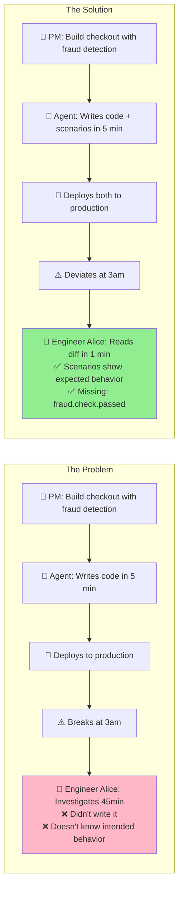
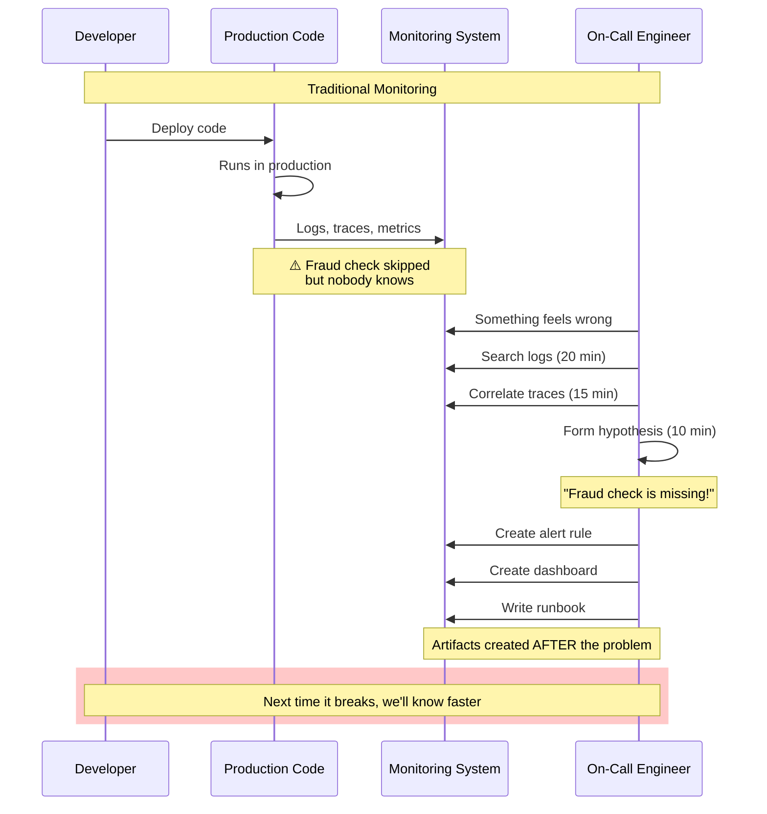
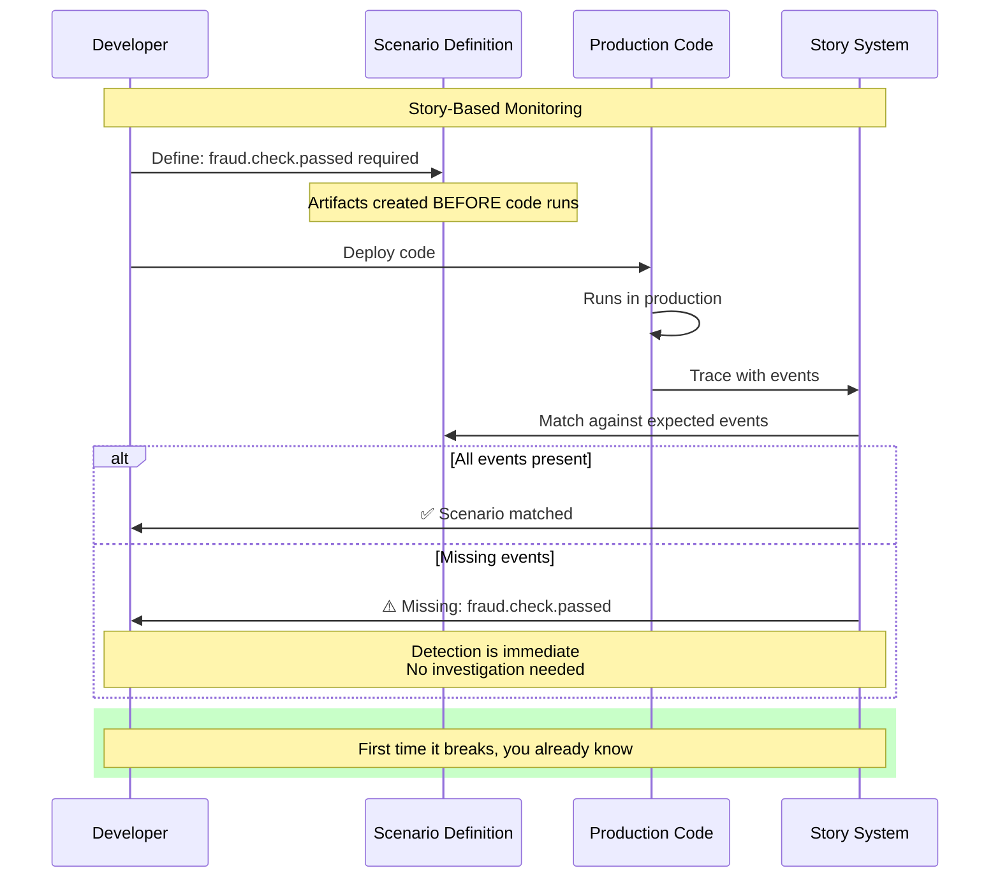
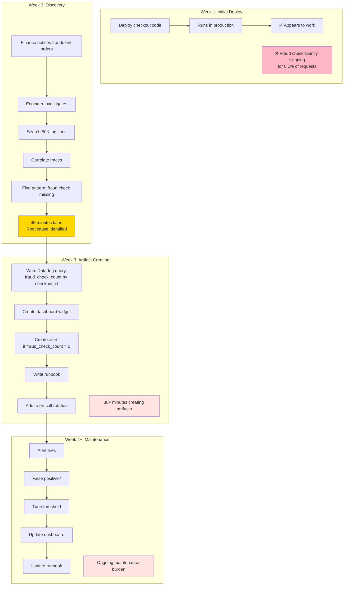
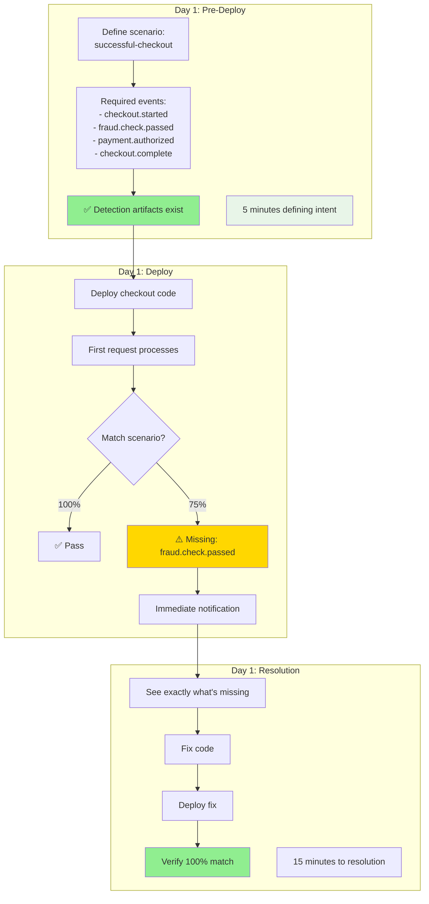
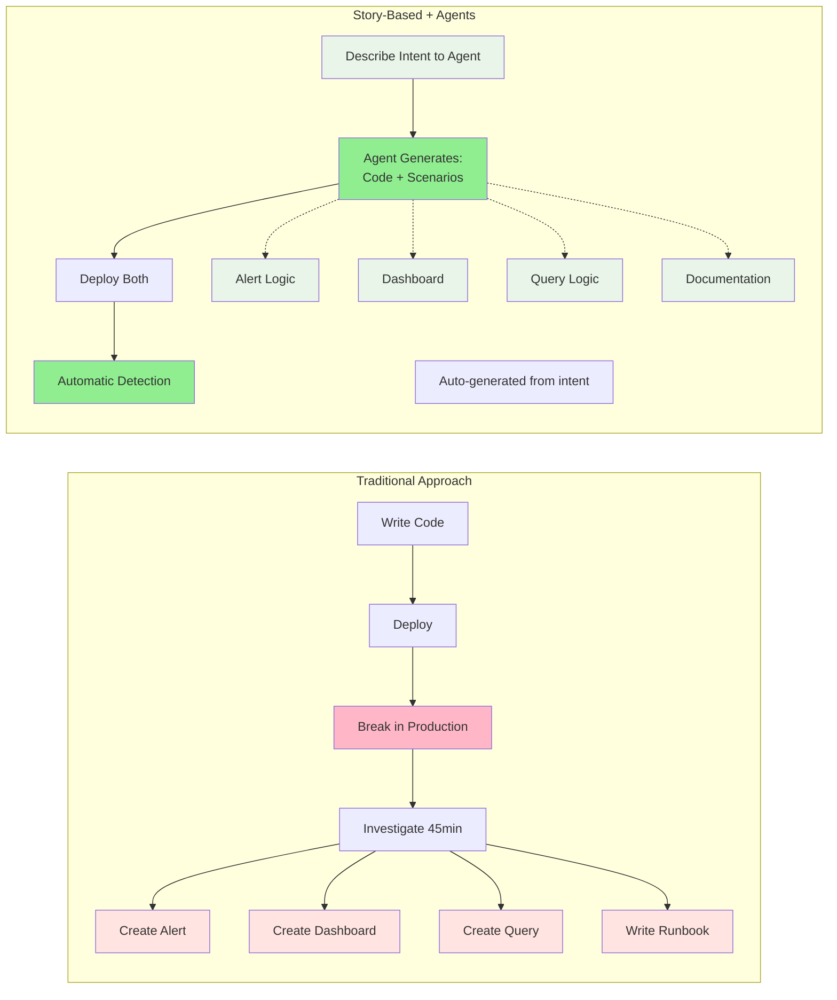
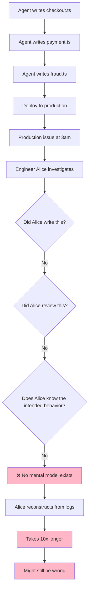
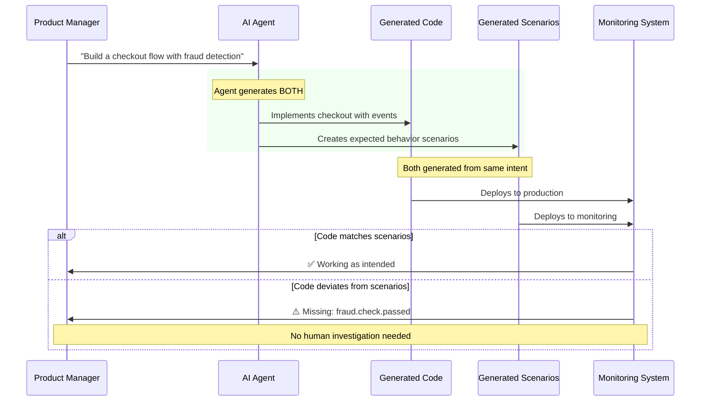
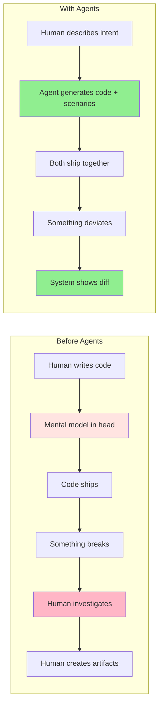

# The Monitoring Artifact Problem
## Why Story-Based Monitoring Is Possible Now (And Necessary)

Agents can write your code in minutes. But when that code breaks in production, who debugs it? How do they know what was supposed to happen? This is the comprehension debt crisis—and it's why monitoring needs to shift left.



## What You're Really Doing With Traditional Tools

Every time you debug a production issue, you're creating artifacts. Queries. Dashboards. Alert rules. Runbooks. These artifacts encode what you learned: "This is what should have happened."

The problem? You're creating them **after** the code runs, **after** something breaks, and **after** you've spent 45 minutes reconstructing what went wrong.

Story-based monitoring shifts that work left. Define what should happen **before** the code runs. The artifacts generate automatically.

**And now, with agentic development, this approach isn't just better—it's actually viable.**

Agents can write your code. They can write your scenarios. They can instrument your telemetry. The shift left is no longer a manual burden—it's an automated byproduct of telling an agent what you want to build.

## The Artifact Creation Loop





## The Same Checkout Bug, Two Ways

### Traditional: Building Detection Artifacts Reactively



**Artifacts created:**
- ❌ Custom Datadog query
- ❌ Dashboard panel
- ❌ Alert rule with threshold tuning
- ❌ Runbook documentation
- ❌ Manual correlation logic
- ❌ Maintenance overhead

**Time to detection:** 2+ weeks
**Time to create artifacts:** 75+ minutes
**Ongoing maintenance:** High

### Story-Based: Detection Artifacts Exist From Day One



**Artifacts created automatically:**
- ✅ Scenario matching logic
- ✅ Visual diff (expected vs actual)
- ✅ Missing event detection
- ✅ Automatic categorization
- ✅ Self-documenting behavior
- ✅ Zero maintenance

**Time to detection:** First request
**Time to create artifacts:** 5 minutes (one-time)
**Ongoing maintenance:** Zero

## The Visual Comparison: What You See

### Traditional Trace View
```
Span: handleCheckout
Duration: 245ms
Status: OK
Events:
  └─ checkout.started (t=0ms)
  └─ payment.authorized (t=89ms)
  └─ inventory.reserved (t=112ms)
  └─ checkout.complete (t=203ms)

❓ Question: Is this correct?
🤷 Answer: You have to already know
```

To detect the problem, you need to:
1. Remember that fraud check should exist
2. Write a query to count fraud events
3. Correlate checkout IDs
4. Set up an alert
5. Create a dashboard
6. Document the expected behavior

### Story-Based View
```
Scenario: successful-checkout (75% match) ⚠️

Expected Events          Observed
─────────────────────────────────────
✓ checkout.started       ✓ Present (t=0ms)
✗ fraud.check.passed     ✗ MISSING
✓ payment.authorized     ✓ Present (t=89ms)
✓ inventory.reserved     ✓ Present (t=112ms)
✓ checkout.complete      ✓ Present (t=203ms)

⚠️ Status: Orphaned
📊 Match: 75% (4/5 events)
🚨 Missing: fraud.check.passed
```

The artifact already exists. You just read it.

## What Gets Shifted Left



### The Comprehension Debt Crisis

When humans wrote all the code, they could reconstruct what should have happened because they built it. The mental model existed.

**But teams shipping agent-written code face a new problem:**



This is **comprehension debt**. The gap between how fast you can generate code and how fast you can understand it when it breaks.

**The traditional solution:** Slow down generation, add more review, document everything manually.

**The story-based solution:** Generate the understanding (scenarios) automatically, at the same time as the code.

| Approach | Agent Writes Code | Who Debugs | Mental Model Location | Investigation Time |
|----------|-------------------|------------|----------------------|-------------------|
| **Traditional Monitoring** | ✅ Yes | Different human | ❌ Nowhere | 45+ min (reconstructing from scratch) |
| **Story-Based (Manual)** | ✅ Yes | Different human | ✅ In scenarios (manual) | 1-5 min (read the diff) |
| **Story-Based (Agent)** | ✅ Yes | Different human | ✅ In scenarios (auto-generated) | 1-5 min (read the diff) |

**The breakthrough:** Agents don't just write code faster. They make it possible to generate the behavioral documentation (scenarios) that human debuggers need—without any additional effort.

## The Effort Comparison

| What | Traditional (Human) | Story-Based (Human) | Story-Based (Agent) |
|------|-------------|-------------|-------------|
| **When you create artifacts** | After something breaks | Before code deploys | Same time as code generation |
| **Time to create** | 30-60 min per incident | 5 min one-time | ~0 min (generated from requirements) |
| **What you create** | Queries, alerts, dashboards, runbooks | Scenario definitions | Natural language requirements |
| **Who creates** | Engineer investigates and writes | Engineer defines expected behavior | Agent generates from intent |
| **Maintenance** | Update queries, tune thresholds, fix false positives | None - scenarios are self-validating | None - scenarios are self-validating |
| **Coverage** | Only issues you've seen before | All defined scenarios from day one | All scenarios from requirements |
| **Detection time** | Hours to weeks | First request | First request |
| **Knowledge required** | Deep system knowledge | Business logic only | Describe what you want |
| **Works with agent-written code?** | ❌ No mental model to reconstruct | ✅ Scenarios document behavior | ✅ Generated together with code |

### The Key Insight

**Without agents:** Creating scenarios upfront required effort, but saved massive investigation time later.

**With agents:** Creating scenarios is automatic. The same prompt that generates your code generates your expected behavior. Zero additional effort. Complete coverage from day one.

This is why story-based monitoring is possible now. Not because the technology didn't exist before—but because agents made the artifact creation effortless.

## Why This Is Possible Now: The Agent Factor

Traditional monitoring was designed for a world where humans wrote the code. The human carried the mental model. They knew what should happen because they designed it.

That world is gone.

```mermaid
graph TB
    subgraph Old["Traditional Development (Human-Written)"]
        O1[Engineer writes code] --> O2[Engineer has mental model]
        O2 --> O3[Code breaks in production]
        O3 --> O4[Same engineer debugs]
        O4 --> O5[Mental model helps reconstruct]
        O5 --> O6[Create monitoring artifacts]

        Note1[Mental model is in human's head]

        style Note1 fill:#E8E8E8
    end

    subgraph New["Agentic Development (AI-Written)"]
        N1[Human describes intent] --> N2[Agent writes code]
        N1 --> N3[Agent writes scenarios]
        N2 --> N4[Code breaks in production]
        N4 --> N5[Different human debugs]
        N5 --> N6[❌ No mental model exists]

        N3 --> N7[✅ Scenarios ARE the mental model]
        N7 --> N8[Automatic detection]

        Note2[Mental model is in scenarios]

        style N6 fill:#FFB6C6
        style N7 fill:#90EE90
        style N8 fill:#90EE90
        style Note2 fill:#E8F5E8
    end
```



### The Numbers Don't Lie

- **84% of developers** now use AI coding tools
- **59% ship code** they don't fully understand
- The person on call at 3am **didn't write what broke**, didn't review what shipped, and doesn't hold the mental model

The traditional artifact-creation workflow assumed human knowledge transfer. That assumption is broken.

### What Agents Change

**Before agents, creating monitoring artifacts was manual:**
1. Human investigates production issue
2. Human reconstructs what should have happened
3. Human writes queries, alerts, dashboards
4. Human documents in runbooks
5. Human maintains and tunes over time

**With agents, monitoring artifacts generate from intent:**



**The prompt you give the agent contains the intent.** That same intent generates both the code and the expected behavior. The scenarios are no longer an afterthought—they're a natural byproduct of describing what you want.

### Example: Agent-Generated Monitoring

**You tell the agent:**
> "Build a checkout flow. It should validate the cart, run a fraud check, authorize payment, reserve inventory, and complete the order."

**The agent generates:**

**Code** (with instrumentation):
```typescript
async function handleCheckout(cartId: string) {
  span.addEvent('checkout.started');
  await validateCart(cartId);

  const fraudResult = await fraudCheck(cartId);
  span.addEvent('fraud.check.passed', { score: fraudResult.score });

  await authorizePayment(cartId);
  span.addEvent('payment.authorized');

  await reserveInventory(cartId);
  span.addEvent('inventory.reserved');

  span.addEvent('checkout.complete');
}
```

**Scenario** (from the same intent):
```json
{
  "id": "successful-checkout",
  "events": {
    "checkout.started": "Cart validation began",
    "fraud.check.passed": "Fraud check completed",
    "payment.authorized": "Payment processed",
    "inventory.reserved": "Items reserved",
    "checkout.complete": "Order confirmed"
  }
}
```

Both generated from the same description. Both deployed together. The monitoring artifacts exist before the first request.

### The Shift: From Investigation to Intent



The artifact creation hasn't disappeared—it's moved. Instead of creating monitoring artifacts after investigating production failures, you're creating them (via agents) from the same requirements that generate the code.

**Same artifacts. Same value. Zero manual effort. Perfect alignment.**

### Why Now? The Timing Isn't Coincidence

Story-based monitoring existed conceptually for years. Teams talked about "intent-driven monitoring" and "behavioral validation." It never took off.

**Why?**

Because creating the scenarios manually was just another burden. Engineers already had tests to write, documentation to maintain, and code to ship. Adding scenario definitions felt like overhead.

**What changed?**

Agents changed the cost structure completely:

| Task | Before Agents | With Agents |
|------|--------------|-------------|
| Write checkout code | 2 hours | 5 minutes |
| Write checkout tests | 1 hour | 2 minutes |
| Write checkout scenarios | 30 minutes | **0 minutes** (generated from requirements) |
| Instrument telemetry | 30 minutes | **0 minutes** (generated with code) |
| **Total effort** | 4 hours | 7 minutes |

The scenarios are no longer incremental work. They're a free byproduct of the same prompt that generates your code.

**Before agents:** "We should define expected behavior, but we don't have time."

**With agents:** "Expected behavior gets generated automatically. Why wouldn't we use it?"

This is the unlock. The technology for story-based monitoring has been possible for years. Agents made it **effortless**.

## The Real Difference

**Traditional monitoring asks:** "What broke and how do we detect it next time?"

**Story-based monitoring asks:** "What should happen in the first place?"

**Agentic development makes the answer to that second question automatic.**

One builds detection artifacts reactively, after human investigation. The other generates them automatically from intent, at the same time the code is generated.

Same artifacts. Different starting point. And now, with agents writing both code and scenarios, massively different effort.

---

**We're building this.** We're in alpha. If you're shipping agent-written code to production and want the monitoring artifacts to generate as automatically as the code does, let's talk.

principal-ade.com
