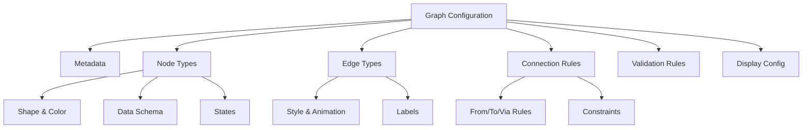
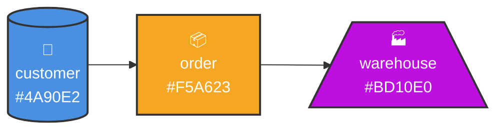
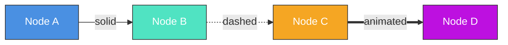
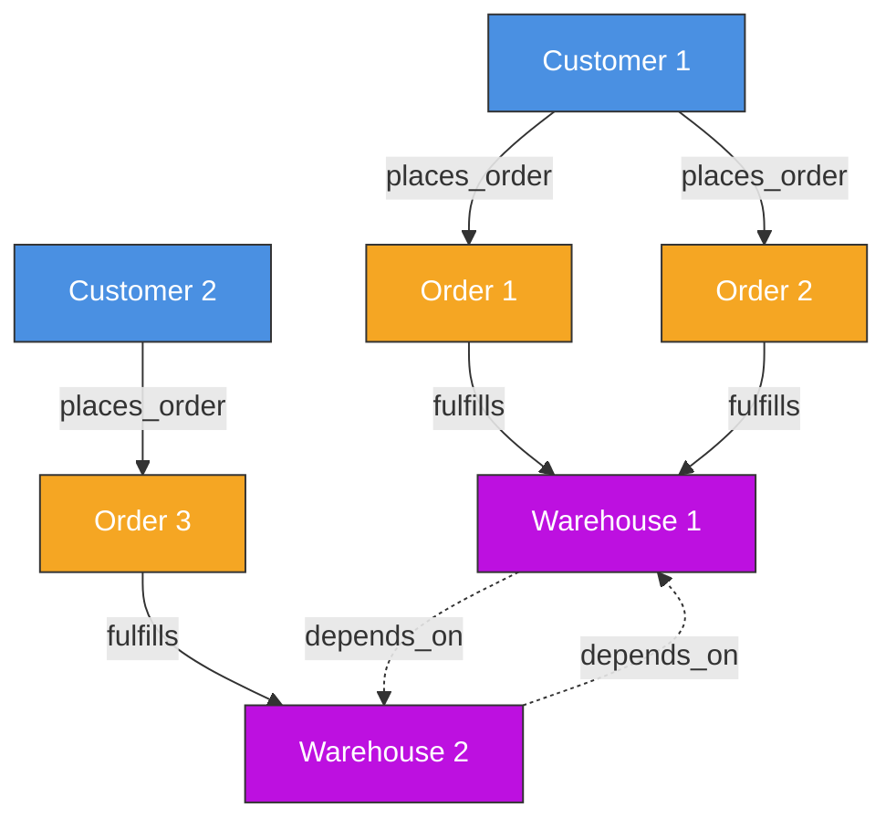
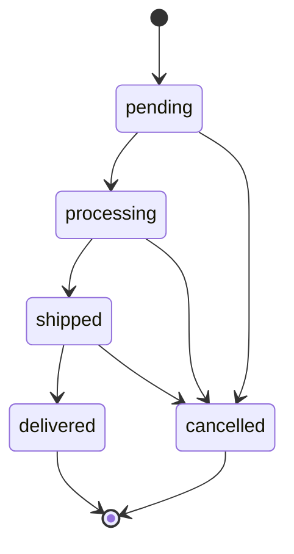
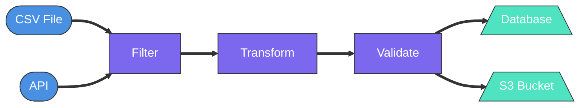
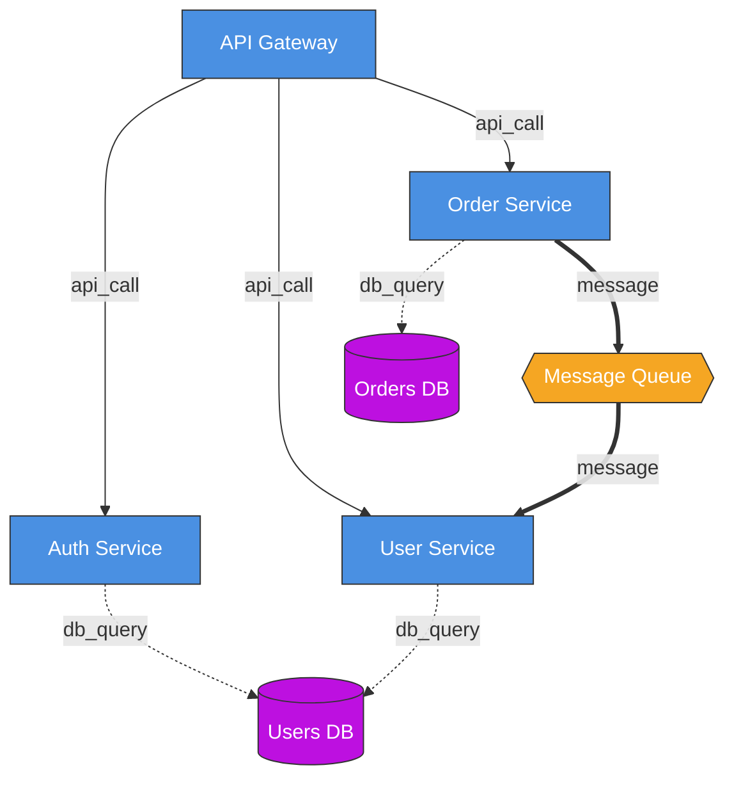

# Graph Configuration Guide

This guide explains how to configure the Visual Validation Framework to visualize your system's behavior.

## Table of Contents

1. [Overview](#overview)
2. [Graph Configuration](#graph-configuration)
3. [Node Types](#node-types)
4. [Edge Types](#edge-types)
5. [Connection Rules](#connection-rules)
6. [Validation Rules](#validation-rules)
7. [Display Configuration](#display-configuration)
8. [Complete Examples](#complete-examples)

## Overview

The Visual Validation Framework uses a declarative configuration to define:
- **What** nodes and edges can exist (node/edge types)
- **How** they can connect (connection rules)
- **What** validation rules apply (validation configuration)
- **How** they should appear (display configuration)



## Graph Configuration

The root configuration object defines your entire graph system:

```typescript
interface GraphConfiguration {
  metadata: {
    name: string;           // System name
    version: string;        // Configuration version
    description?: string;   // Optional description
  };

  nodeTypes: Record<string, NodeTypeDefinition>;
  edgeTypes: Record<string, EdgeTypeDefinition>;
  allowedConnections: ConnectionRule[];

  validation?: ValidationRules;
  display?: DisplayConfiguration;
}
```

### Example: Minimal Configuration

```typescript
const config: GraphConfiguration = {
  metadata: {
    name: "Order Processing System",
    version: "1.0.0",
    description: "Tracks orders from submission to fulfillment"
  },
  nodeTypes: {
    order: { /* ... */ },
    warehouse: { /* ... */ }
  },
  edgeTypes: {
    processing: { /* ... */ }
  },
  allowedConnections: [
    { from: "order", to: "warehouse", via: "processing" }
  ]
};
```

## Node Types

Node types define the visual and logical characteristics of nodes in your graph.

```typescript
interface NodeTypeDefinition {
  // Visual representation
  shape: 'circle' | 'rectangle' | 'hexagon' | 'diamond' | 'custom';
  icon?: string;
  color?: string;
  size?: { width: number; height: number };

  // Data schema - what fields this node type has
  dataSchema: {
    [field: string]: {
      type: 'string' | 'number' | 'boolean' | 'object' | 'array';
      required?: boolean;
      displayInLabel?: boolean;
    };
  };

  // State definitions - visual states the node can be in
  states?: Record<string, {
    color?: string;
    icon?: string;
    label?: string;
  }>;

  // Layout hints
  layout?: {
    layer?: number;    // Vertical layer in hierarchical layout
    cluster?: string;  // Group nodes together
  };
}
```

### Example: E-commerce Node Types

```typescript
const nodeTypes = {
  customer: {
    shape: 'circle',
    icon: '👤',
    color: '#4A90E2',
    dataSchema: {
      customerId: { type: 'string', required: true, displayInLabel: true },
      name: { type: 'string', required: true },
      email: { type: 'string', required: true }
    },
    states: {
      active: { color: '#50E3C2', label: 'Active' },
      inactive: { color: '#999999', label: 'Inactive' }
    }
  },

  order: {
    shape: 'rectangle',
    icon: '📦',
    color: '#F5A623',
    dataSchema: {
      orderId: { type: 'string', required: true, displayInLabel: true },
      amount: { type: 'number', required: true },
      items: { type: 'array', required: true }
    },
    states: {
      pending: { color: '#F5A623', label: 'Pending' },
      processing: { color: '#7B68EE', label: 'Processing' },
      shipped: { color: '#50E3C2', label: 'Shipped' },
      delivered: { color: '#4A90E2', label: 'Delivered' },
      cancelled: { color: '#D0021B', label: 'Cancelled' }
    },
    layout: {
      layer: 1  // Middle layer in hierarchy
    }
  },

  warehouse: {
    shape: 'hexagon',
    icon: '🏭',
    color: '#BD10E0',
    dataSchema: {
      warehouseId: { type: 'string', required: true, displayInLabel: true },
      location: { type: 'string', required: true },
      capacity: { type: 'number', required: true }
    },
    layout: {
      layer: 2  // Bottom layer
    }
  }
};
```



## Edge Types

Edge types define how connections between nodes appear and behave.

```typescript
interface EdgeTypeDefinition {
  // Visual style
  style: 'solid' | 'dashed' | 'dotted' | 'animated';
  color?: string;
  width?: number;
  directed?: boolean;

  // Edge label configuration
  label?: {
    field?: string;              // Which data field to display
    position?: 'start' | 'middle' | 'end';
  };

  // Animation configuration
  animation?: {
    type: 'flow' | 'pulse' | 'particle';
    duration?: number;
    color?: string;
  };
}
```

### Example: E-commerce Edge Types

```typescript
const edgeTypes = {
  places_order: {
    style: 'solid',
    color: '#4A90E2',
    width: 2,
    directed: true,
    label: {
      field: 'timestamp',
      position: 'middle'
    }
  },

  fulfills: {
    style: 'animated',
    color: '#50E3C2',
    width: 3,
    directed: true,
    animation: {
      type: 'flow',
      duration: 2000,
      color: '#50E3C2'
    }
  },

  depends_on: {
    style: 'dashed',
    color: '#999999',
    width: 1,
    directed: false
  }
};
```



## Connection Rules

Connection rules define which node types can connect to each other and via which edge types.

```typescript
interface ConnectionRule {
  from: string;      // Source node type
  to: string;        // Target node type
  via: string;       // Edge type

  constraints?: {
    maxInstances?: number;   // Max connections of this type
    bidirectional?: boolean; // Allow connections in both directions
    exclusive?: boolean;     // If true, this is the ONLY allowed connection
  };
}
```

### Example: E-commerce Connection Rules

```typescript
const allowedConnections = [
  {
    from: "customer",
    to: "order",
    via: "places_order",
    constraints: {
      maxInstances: undefined  // Unlimited orders per customer
    }
  },
  {
    from: "order",
    to: "warehouse",
    via: "fulfills",
    constraints: {
      maxInstances: 1  // Each order fulfilled by exactly one warehouse
    }
  },
  {
    from: "warehouse",
    to: "warehouse",
    via: "depends_on",
    constraints: {
      bidirectional: true  // Warehouses can depend on each other
    }
  }
];
```



## Validation Rules

Validation rules define constraints and state transitions that must be followed.

```typescript
interface ValidationRules {
  // State transition rules per node type
  stateTransitions?: Record<string, Array<{
    from: string;
    to: string[];
  }>>;

  // Global constraints
  constraints?: Array<{
    id: string;
    description: string;
    check: string;
    severity: 'info' | 'warning' | 'error';
  }>;

  // Cardinality rules
  cardinality?: Record<string, {
    min?: number;
    max?: number;
  }>;
}
```

### Example: Order State Transitions

```typescript
const validation = {
  stateTransitions: {
    order: [
      { from: "pending", to: ["processing", "cancelled"] },
      { from: "processing", to: ["shipped", "cancelled"] },
      { from: "shipped", to: ["delivered", "cancelled"] },
      { from: "delivered", to: [] },  // Terminal state
      { from: "cancelled", to: [] }   // Terminal state
    ]
  },

  constraints: [
    {
      id: "order_amount_positive",
      description: "Order amount must be positive",
      check: "node.data.amount > 0",
      severity: "error"
    },
    {
      id: "warehouse_capacity",
      description: "Warehouse should not exceed capacity",
      check: "connectedOrders.length <= node.data.capacity",
      severity: "warning"
    }
  ],

  cardinality: {
    customer: { min: 1 },      // At least one customer
    warehouse: { min: 1, max: 10 }  // 1-10 warehouses
  }
};
```



## Display Configuration

Display configuration controls the visual appearance and layout behavior.

```typescript
interface DisplayConfiguration {
  // Default layout algorithm
  layout: 'hierarchical' | 'force-directed' | 'circular' | 'manual';

  // Color scheme
  theme?: {
    primary: string;
    success: string;
    warning: string;
    danger: string;
    info: string;
  };

  // Animation preferences
  animations?: {
    enabled: boolean;
    speed: number;
  };
}
```

### Example: Display Configuration

```typescript
const display = {
  layout: 'hierarchical',
  theme: {
    primary: '#4A90E2',
    success: '#50E3C2',
    warning: '#F5A623',
    danger: '#D0021B',
    info: '#7B68EE'
  },
  animations: {
    enabled: true,
    speed: 1.0
  }
};
```

## Complete Examples

### Example 1: Simple Data Pipeline

```typescript
const dataPipelineConfig: GraphConfiguration = {
  metadata: {
    name: "Data Processing Pipeline",
    version: "1.0.0"
  },

  nodeTypes: {
    source: {
      shape: 'circle',
      color: '#4A90E2',
      dataSchema: {
        name: { type: 'string', required: true, displayInLabel: true }
      }
    },
    processor: {
      shape: 'rectangle',
      color: '#7B68EE',
      dataSchema: {
        operation: { type: 'string', required: true, displayInLabel: true }
      }
    },
    sink: {
      shape: 'hexagon',
      color: '#50E3C2',
      dataSchema: {
        destination: { type: 'string', required: true, displayInLabel: true }
      }
    }
  },

  edgeTypes: {
    dataflow: {
      style: 'animated',
      color: '#999999',
      animation: {
        type: 'flow',
        duration: 1500
      }
    }
  },

  allowedConnections: [
    { from: "source", to: "processor", via: "dataflow" },
    { from: "processor", to: "processor", via: "dataflow" },
    { from: "processor", to: "sink", via: "dataflow" }
  ],

  display: {
    layout: 'hierarchical'
  }
};
```



### Example 2: Microservices Architecture

```typescript
const microservicesConfig: GraphConfiguration = {
  metadata: {
    name: "Microservices System",
    version: "1.0.0"
  },

  nodeTypes: {
    service: {
      shape: 'rectangle',
      color: '#4A90E2',
      dataSchema: {
        name: { type: 'string', required: true, displayInLabel: true },
        port: { type: 'number', required: true }
      },
      states: {
        running: { color: '#50E3C2', label: 'Running' },
        stopped: { color: '#999999', label: 'Stopped' },
        error: { color: '#D0021B', label: 'Error' }
      }
    },
    database: {
      shape: 'circle',
      color: '#BD10E0',
      dataSchema: {
        type: { type: 'string', required: true, displayInLabel: true }
      }
    },
    queue: {
      shape: 'diamond',
      color: '#F5A623',
      dataSchema: {
        name: { type: 'string', required: true, displayInLabel: true }
      }
    }
  },

  edgeTypes: {
    api_call: {
      style: 'solid',
      color: '#4A90E2',
      directed: true
    },
    db_query: {
      style: 'dashed',
      color: '#BD10E0',
      directed: true
    },
    message: {
      style: 'animated',
      color: '#F5A623',
      animation: {
        type: 'particle',
        duration: 1000
      }
    }
  },

  allowedConnections: [
    { from: "service", to: "service", via: "api_call" },
    { from: "service", to: "database", via: "db_query" },
    { from: "service", to: "queue", via: "message" },
    { from: "queue", to: "service", via: "message" }
  ],

  validation: {
    stateTransitions: {
      service: [
        { from: "stopped", to: ["running"] },
        { from: "running", to: ["stopped", "error"] },
        { from: "error", to: ["stopped", "running"] }
      ]
    }
  },

  display: {
    layout: 'force-directed',
    animations: {
      enabled: true,
      speed: 1.0
    }
  }
};
```



## Next Steps

- See [USAGE.md](./USAGE.md) for how to use the configuration with React components
- See [EVENT_SYSTEM.md](./EVENT_SYSTEM.md) for how to stream events to update the graph
- Check out the Storybook examples for interactive demos
