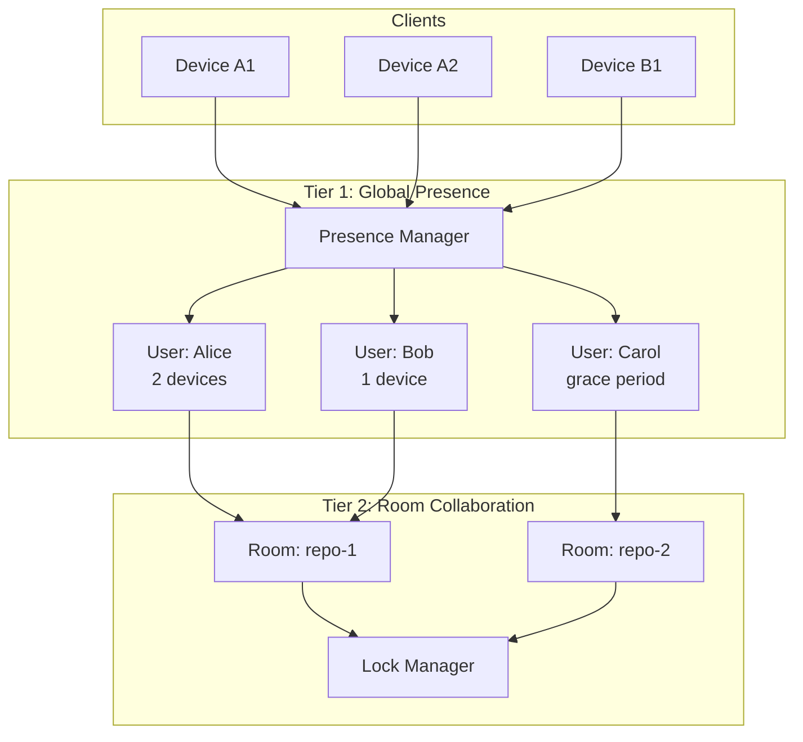
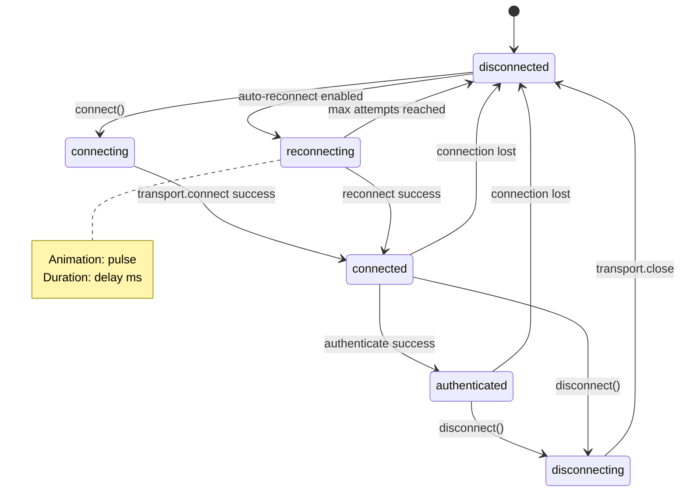
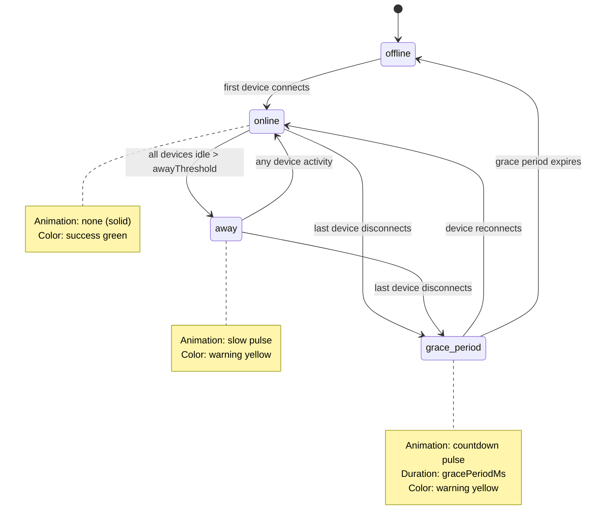
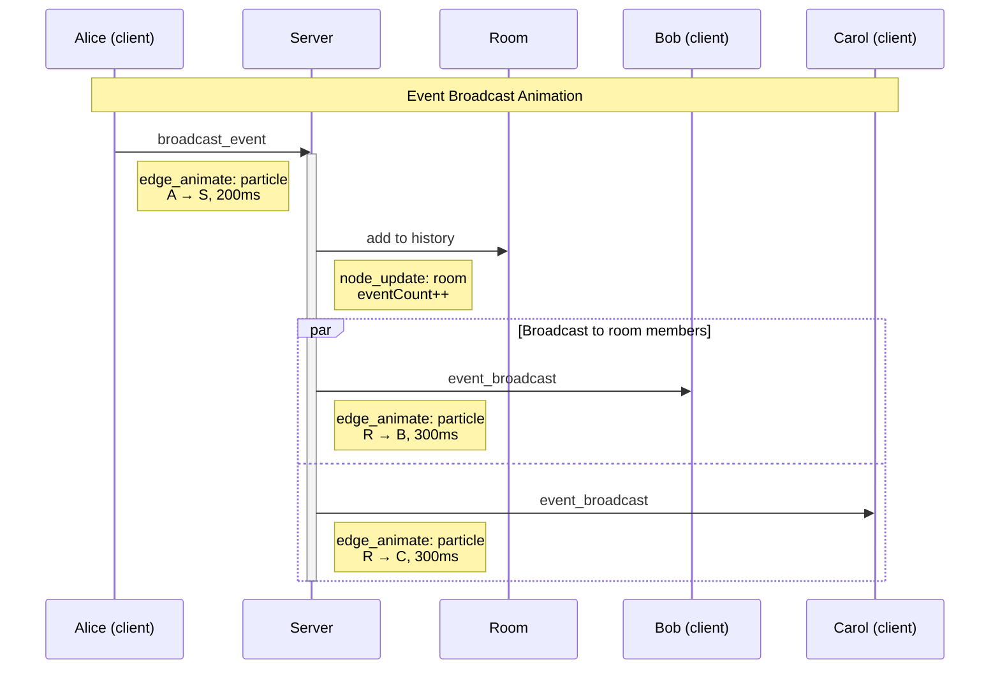

# Control Tower Canvas Animation Design

This document describes how to visualize Control Tower client-server interactions using the Principal View canvas system. It defines the structured logging schema, canvas file structure, and animation patterns needed to bring the two-tier architecture to life.

## Table of Contents

1. [Overview](#overview)
2. [Architecture Visualization Goals](#architecture-visualization-goals)
3. [Structured Logging Schema](#structured-logging-schema)
4. [Canvas File Definitions](#canvas-file-definitions)
5. [Event-to-Animation Mapping](#event-to-animation-mapping)
6. [Example Canvases](#example-canvases)
7. [Implementation Roadmap](#implementation-roadmap)

## Overview

Control Tower is a real-time collaboration system with a two-tier architecture:



The canvas visualization will animate:
- **Connection lifecycle**: clients connecting, authenticating, disconnecting
- **Presence states**: online/away/offline transitions with grace periods
- **Room membership**: joins, leaves, user presence per room
- **Message flow**: events broadcast between clients through rooms
- **Lock management**: acquisition, queueing, release

## Architecture Visualization Goals

### Primary Canvas: Two-Tier Overview

The main canvas shows the relationship between global presence and room-level collaboration:

```
┌─────────────────────────────────────────────────────────────────┐
│  GLOBAL PRESENCE TIER                                           │
│  ┌──────────┐  ┌──────────┐  ┌──────────┐  ┌──────────┐        │
│  │  Alice   │  │   Bob    │  │  Carol   │  │  David   │        │
│  │    🟢    │  │    🟢    │  │    🟡    │  │    ⚫    │        │
│  │ 2 devices│  │ 1 device │  │   away   │  │ offline  │        │
│  └──────────┘  └──────────┘  └──────────┘  └──────────┘        │
└─────────────────────────────────────────────────────────────────┘
                              │
                              ▼
┌─────────────────────────────────────────────────────────────────┐
│  ROOM COLLABORATION TIER                                        │
│  ┌─────────────────────┐    ┌─────────────────────┐            │
│  │ Room: main-repo     │    │ Room: feature-branch │            │
│  │ ┌─────┐ ┌─────┐    │    │ ┌─────┐             │            │
│  │ │Alice│ │ Bob │    │    │ │Carol│             │            │
│  │ └─────┘ └─────┘    │    │ └─────┘             │            │
│  │ 🔒 src/index.ts    │    │                     │            │
│  └─────────────────────┘    └─────────────────────┘            │
└─────────────────────────────────────────────────────────────────┘
```

### Secondary Canvases

1. **Connection Lifecycle Canvas** - Focus on connect/disconnect/reconnect flows
2. **Message Flow Canvas** - Animate broadcast events between clients
3. **Lock Queue Canvas** - Visualize lock acquisition and waiting
4. **Grace Period Canvas** - Show reconnection within grace period window

## Structured Logging Schema

To drive canvas animations, Control Tower must emit structured log events. These events bridge the existing `ServerEvents`/`ClientEvents` to the Principal View `GraphEvent` format.

### CanvasLogEvent Base Type

```typescript
/**
 * Base event structure for canvas-compatible logging.
 * Extends the Principal View GraphEvent format with Control Tower specifics.
 */
interface CanvasLogEvent {
  // Required fields
  id: string;                    // Unique event ID (uuid or nanoid)
  timestamp: number;             // Unix timestamp in milliseconds
  source: 'server' | 'client';   // Which side emitted the event

  // Event classification
  tier: 'connection' | 'presence' | 'room' | 'lock' | 'message';
  event: string;                 // Maps to ServerEvents/ClientEvents names

  // Entity identifiers (include all relevant IDs)
  entities: {
    clientId?: string;
    userId?: string;
    deviceId?: string;
    roomId?: string;
    lockId?: string;
    messageId?: string;
  };

  // State information for animations
  state?: {
    previous?: string;
    current: string;
  };

  // Event-specific payload
  payload: Record<string, unknown>;

  // Animation hints (optional, can be derived from event type)
  animation?: {
    type: 'node_create' | 'node_update' | 'node_delete' |
          'edge_create' | 'edge_animate' | 'edge_delete' |
          'state_change';
    targets: string[];           // Node/edge IDs affected
    duration?: number;           // Animation duration in ms
  };
}
```

### Event Type Mappings

Map Control Tower events to canvas log events:

```typescript
/**
 * Connection Tier Events
 */
interface ConnectionLogEvents {
  // Client connects to server
  'connection:established': {
    tier: 'connection';
    event: 'client_connected';
    entities: { clientId: string };
    state: { current: 'connected' };
    animation: {
      type: 'node_create';
      targets: ['client-{clientId}'];
    };
  };

  // Client authenticates
  'connection:authenticated': {
    tier: 'connection';
    event: 'client_authenticated';
    entities: { clientId: string; userId: string };
    state: { previous: 'connected'; current: 'authenticated' };
    animation: {
      type: 'state_change';
      targets: ['client-{clientId}'];
    };
  };

  // Client disconnects
  'connection:closed': {
    tier: 'connection';
    event: 'client_disconnected';
    entities: { clientId: string; userId?: string };
    state: { previous: 'connected' | 'authenticated'; current: 'disconnected' };
    payload: { reason: string };
    animation: {
      type: 'node_delete';
      targets: ['client-{clientId}'];
    };
  };

  // Client reconnecting
  'connection:reconnecting': {
    tier: 'connection';
    event: 'reconnecting';
    entities: { clientId: string };
    state: { previous: 'disconnected'; current: 'reconnecting' };
    payload: { attempt: number; delay: number };
    animation: {
      type: 'state_change';
      targets: ['client-{clientId}'];
    };
  };
}

/**
 * Presence Tier Events
 */
interface PresenceLogEvents {
  // Device registers with presence system
  'presence:device_connected': {
    tier: 'presence';
    event: 'presence_device_connected';
    entities: { userId: string; deviceId: string };
    payload: { metadata?: Record<string, unknown> };
    animation: {
      type: 'edge_create';
      targets: ['user-{userId}', 'device-{deviceId}'];
    };
  };

  // Device disconnects from presence
  'presence:device_disconnected': {
    tier: 'presence';
    event: 'presence_device_disconnected';
    entities: { userId: string; deviceId: string };
    animation: {
      type: 'edge_delete';
      targets: ['user-{userId}-device-{deviceId}'];
    };
  };

  // User status changes
  'presence:status_changed': {
    tier: 'presence';
    event: 'presence_changed';
    entities: { userId: string };
    state: {
      previous: 'online' | 'away' | 'offline';
      current: 'online' | 'away' | 'offline';
    };
    payload: { reason?: string };
    animation: {
      type: 'state_change';
      targets: ['user-{userId}'];
    };
  };

  // Grace period started
  'presence:grace_period_started': {
    tier: 'presence';
    event: 'presence_grace_started';
    entities: { userId: string };
    state: { previous: 'online'; current: 'grace_period' };
    payload: { expiresAt: number; gracePeriodMs: number };
    animation: {
      type: 'state_change';
      targets: ['user-{userId}'];
      duration: /* gracePeriodMs */;
    };
  };

  // Grace period expired
  'presence:grace_period_expired': {
    tier: 'presence';
    event: 'presence_grace_expired';
    entities: { userId: string };
    state: { previous: 'grace_period'; current: 'offline' };
    animation: {
      type: 'state_change';
      targets: ['user-{userId}'];
    };
  };
}

/**
 * Room Tier Events
 */
interface RoomLogEvents {
  // Room created
  'room:created': {
    tier: 'room';
    event: 'room_created';
    entities: { roomId: string };
    payload: { config?: Record<string, unknown> };
    animation: {
      type: 'node_create';
      targets: ['room-{roomId}'];
    };
  };

  // Client joins room
  'room:client_joined': {
    tier: 'room';
    event: 'client_joined_room';
    entities: { clientId: string; userId: string; roomId: string };
    animation: {
      type: 'edge_create';
      targets: ['user-{userId}', 'room-{roomId}'];
    };
  };

  // Client leaves room
  'room:client_left': {
    tier: 'room';
    event: 'client_left_room';
    entities: { clientId: string; userId: string; roomId: string };
    animation: {
      type: 'edge_delete';
      targets: ['user-{userId}-room-{roomId}'];
    };
  };

  // Event broadcast in room
  'room:event_broadcast': {
    tier: 'room';
    event: 'event_broadcast';
    entities: { roomId: string; userId: string; messageId: string };
    payload: { eventType: string; data: unknown };
    animation: {
      type: 'edge_animate';
      targets: ['user-{userId}', 'room-{roomId}'];
      duration: 500;
    };
  };
}

/**
 * Lock Tier Events
 */
interface LockLogEvents {
  // Lock acquired
  'lock:acquired': {
    tier: 'lock';
    event: 'lock_acquired';
    entities: { lockId: string; userId: string; roomId?: string };
    payload: { path: string; lockType: string };
    animation: {
      type: 'node_create';
      targets: ['lock-{lockId}'];
    };
  };

  // Lock denied (queued)
  'lock:queued': {
    tier: 'lock';
    event: 'lock_denied';
    entities: { userId: string; roomId?: string };
    payload: { path: string; reason: string; queuePosition: number };
    animation: {
      type: 'edge_create';
      targets: ['user-{userId}', 'lock-queue-{path}'];
    };
  };

  // Lock released
  'lock:released': {
    tier: 'lock';
    event: 'lock_released';
    entities: { lockId: string; userId: string };
    animation: {
      type: 'node_delete';
      targets: ['lock-{lockId}'];
    };
  };
}
```

### Logger Implementation

Add a canvas-aware logger to Control Tower:

```typescript
// control-tower-core/src/logging/CanvasLogger.ts

import type { BaseServer, ServerEvents } from '../server/BaseServer.js';
import type { BaseClient, ClientEvents } from '../client/BaseClient.js';

export interface CanvasLoggerConfig {
  /** Enable/disable canvas logging */
  enabled: boolean;

  /** Output destination */
  output: 'console' | 'file' | 'stream';

  /** File path if output is 'file' */
  filePath?: string;

  /** Stream handler if output is 'stream' */
  onEvent?: (event: CanvasLogEvent) => void;

  /** Filter which tiers to log */
  tiers?: Array<'connection' | 'presence' | 'room' | 'lock' | 'message'>;

  /** Include animation hints in output */
  includeAnimationHints?: boolean;
}

export class CanvasLogger {
  private config: CanvasLoggerConfig;
  private eventBuffer: CanvasLogEvent[] = [];

  constructor(config: CanvasLoggerConfig) {
    this.config = config;
  }

  /**
   * Attach to a BaseServer to capture server-side events
   */
  attachToServer(server: BaseServer): void {
    // Connection events
    server.on('client_connected', ({ client }) => {
      this.emit({
        id: this.generateId(),
        timestamp: Date.now(),
        source: 'server',
        tier: 'connection',
        event: 'client_connected',
        entities: { clientId: client.id, userId: client.userId || undefined },
        state: { current: client.authenticated ? 'authenticated' : 'connected' },
        payload: { connectedAt: client.connectedAt },
        animation: {
          type: 'node_create',
          targets: [`client-${client.id}`]
        }
      });
    });

    server.on('client_authenticated', ({ clientId, userId, metadata }) => {
      this.emit({
        id: this.generateId(),
        timestamp: Date.now(),
        source: 'server',
        tier: 'connection',
        event: 'client_authenticated',
        entities: { clientId, userId },
        state: { previous: 'connected', current: 'authenticated' },
        payload: { metadata },
        animation: {
          type: 'state_change',
          targets: [`client-${clientId}`]
        }
      });
    });

    server.on('client_disconnected', ({ clientId, reason }) => {
      this.emit({
        id: this.generateId(),
        timestamp: Date.now(),
        source: 'server',
        tier: 'connection',
        event: 'client_disconnected',
        entities: { clientId },
        state: { current: 'disconnected' },
        payload: { reason },
        animation: {
          type: 'node_delete',
          targets: [`client-${clientId}`]
        }
      });
    });

    // Presence events
    server.on('presence_device_connected', ({ userId, deviceId, timestamp }) => {
      this.emit({
        id: this.generateId(),
        timestamp,
        source: 'server',
        tier: 'presence',
        event: 'presence_device_connected',
        entities: { userId, deviceId },
        state: { current: 'online' },
        payload: {},
        animation: {
          type: 'edge_create',
          targets: [`user-${userId}`, `device-${deviceId}`]
        }
      });
    });

    server.on('presence_changed', ({ userId, status, timestamp }) => {
      this.emit({
        id: this.generateId(),
        timestamp,
        source: 'server',
        tier: 'presence',
        event: 'presence_changed',
        entities: { userId },
        state: { current: status },
        payload: {},
        animation: {
          type: 'state_change',
          targets: [`user-${userId}`]
        }
      });
    });

    // Room events
    server.on('client_joined_room', ({ clientId, roomId }) => {
      const userId = server.getUserIdFromClientId(clientId);
      this.emit({
        id: this.generateId(),
        timestamp: Date.now(),
        source: 'server',
        tier: 'room',
        event: 'client_joined_room',
        entities: { clientId, userId, roomId },
        state: { current: 'in_room' },
        payload: {},
        animation: {
          type: 'edge_create',
          targets: [`user-${userId}`, `room-${roomId}`]
        }
      });
    });

    server.on('event_broadcast', ({ roomId, event, fromClientId }) => {
      const userId = server.getUserIdFromClientId(fromClientId);
      this.emit({
        id: this.generateId(),
        timestamp: Date.now(),
        source: 'server',
        tier: 'message',
        event: 'event_broadcast',
        entities: { roomId, userId, clientId: fromClientId, messageId: event.id },
        state: { current: 'broadcast' },
        payload: { eventType: event.type, data: event.data },
        animation: {
          type: 'edge_animate',
          targets: [`user-${userId}`, `room-${roomId}`],
          duration: 500
        }
      });
    });

    // Lock events
    server.on('lock_acquired', ({ lock, clientId }) => {
      const userId = server.getUserIdFromClientId(clientId);
      this.emit({
        id: this.generateId(),
        timestamp: Date.now(),
        source: 'server',
        tier: 'lock',
        event: 'lock_acquired',
        entities: { lockId: lock.id, userId, clientId },
        state: { current: 'locked' },
        payload: { path: lock.path, lockType: lock.type },
        animation: {
          type: 'node_create',
          targets: [`lock-${lock.id}`]
        }
      });
    });

    server.on('lock_released', ({ lockId, clientId }) => {
      this.emit({
        id: this.generateId(),
        timestamp: Date.now(),
        source: 'server',
        tier: 'lock',
        event: 'lock_released',
        entities: { lockId, clientId },
        state: { current: 'unlocked' },
        payload: {},
        animation: {
          type: 'node_delete',
          targets: [`lock-${lockId}`]
        }
      });
    });
  }

  /**
   * Attach to a BaseClient to capture client-side events
   */
  attachToClient(client: BaseClient, clientId: string): void {
    client.on('connected', ({ url }) => {
      this.emit({
        id: this.generateId(),
        timestamp: Date.now(),
        source: 'client',
        tier: 'connection',
        event: 'connected',
        entities: { clientId },
        state: { current: 'connected' },
        payload: { url },
        animation: {
          type: 'state_change',
          targets: [`client-${clientId}`]
        }
      });
    });

    client.on('reconnecting', ({ attempt, delay }) => {
      this.emit({
        id: this.generateId(),
        timestamp: Date.now(),
        source: 'client',
        tier: 'connection',
        event: 'reconnecting',
        entities: { clientId },
        state: { previous: 'disconnected', current: 'reconnecting' },
        payload: { attempt, delay },
        animation: {
          type: 'state_change',
          targets: [`client-${clientId}`],
          duration: delay
        }
      });
    });

    client.on('room_joined', ({ roomId, state }) => {
      this.emit({
        id: this.generateId(),
        timestamp: Date.now(),
        source: 'client',
        tier: 'room',
        event: 'room_joined',
        entities: { clientId, roomId, userId: client.getUserId() || undefined },
        state: { current: 'in_room' },
        payload: { userCount: state.users.size },
        animation: {
          type: 'edge_create',
          targets: [`client-${clientId}`, `room-${roomId}`]
        }
      });
    });
  }

  private emit(event: CanvasLogEvent): void {
    // Filter by tier if configured
    if (this.config.tiers && !this.config.tiers.includes(event.tier)) {
      return;
    }

    // Remove animation hints if not configured
    if (!this.config.includeAnimationHints) {
      delete event.animation;
    }

    // Output based on configuration
    switch (this.config.output) {
      case 'console':
        console.log(JSON.stringify(event));
        break;
      case 'file':
        this.eventBuffer.push(event);
        break;
      case 'stream':
        this.config.onEvent?.(event);
        break;
    }
  }

  private generateId(): string {
    return `evt-${Date.now()}-${Math.random().toString(36).substring(2, 9)}`;
  }

  /**
   * Flush buffered events to file
   */
  async flush(): Promise<void> {
    if (this.config.output === 'file' && this.config.filePath) {
      const fs = await import('fs/promises');
      await fs.appendFile(
        this.config.filePath,
        this.eventBuffer.map(e => JSON.stringify(e)).join('\n') + '\n'
      );
      this.eventBuffer = [];
    }
  }
}
```

## Canvas File Definitions

### Two-Tier Architecture Canvas

```json
{
  "nodes": [
    {
      "id": "presence-tier",
      "type": "group",
      "x": 50,
      "y": 50,
      "width": 700,
      "height": 200,
      "label": "Global Presence Tier",
      "pv": {
        "nodeType": "tier-container",
        "fill": "#1a1a2e",
        "stroke": "#4a90e2"
      }
    },
    {
      "id": "room-tier",
      "type": "group",
      "x": 50,
      "y": 300,
      "width": 700,
      "height": 250,
      "label": "Room Collaboration Tier",
      "pv": {
        "nodeType": "tier-container",
        "fill": "#1a1a2e",
        "stroke": "#50e3c2"
      }
    },
    {
      "id": "server",
      "type": "text",
      "x": 375,
      "y": 260,
      "width": 100,
      "height": 40,
      "text": "Server",
      "pv": {
        "nodeType": "server",
        "shape": "hexagon",
        "icon": "server",
        "fill": "#7b68ee",
        "states": {
          "running": { "fill": "#50e3c2", "icon": "server" },
          "stopped": { "fill": "#ff6b6b", "icon": "server-off" }
        },
        "sources": ["control-tower-core/src/server/**/*.ts"]
      }
    }
  ],
  "edges": [],
  "pv": {
    "canvasType": "control-tower-architecture",
    "title": "Control Tower Two-Tier Architecture",
    "description": "Visualizes the global presence and room collaboration tiers",
    "eventSources": {
      "logFile": "./logs/canvas-events.jsonl",
      "websocket": "ws://localhost:8080/canvas-events"
    },
    "nodeTemplates": {
      "user": {
        "shape": "circle",
        "width": 80,
        "height": 80,
        "icon": "user",
        "states": {
          "online": { "fill": "#50e3c2", "icon": "user-check" },
          "away": { "fill": "#f5a623", "icon": "user-clock" },
          "offline": { "fill": "#666666", "icon": "user-x" },
          "grace_period": { "fill": "#f5a623", "icon": "user-clock", "animation": "pulse" }
        },
        "dataSchema": {
          "userId": { "type": "string", "label": "User ID" },
          "deviceCount": { "type": "number", "label": "Devices" },
          "status": { "type": "string", "label": "Status" }
        }
      },
      "device": {
        "shape": "rectangle",
        "width": 60,
        "height": 40,
        "icon": "monitor",
        "states": {
          "connected": { "fill": "#4a90e2" },
          "authenticated": { "fill": "#50e3c2" },
          "disconnected": { "fill": "#666666" },
          "reconnecting": { "fill": "#f5a623", "animation": "pulse" }
        }
      },
      "room": {
        "shape": "rectangle",
        "width": 200,
        "height": 120,
        "icon": "box",
        "fill": "#2d3748",
        "stroke": "#4a90e2",
        "states": {
          "active": { "stroke": "#50e3c2" },
          "empty": { "stroke": "#666666" }
        },
        "dataSchema": {
          "roomId": { "type": "string", "label": "Room ID" },
          "userCount": { "type": "number", "label": "Users" },
          "lockCount": { "type": "number", "label": "Active Locks" }
        }
      },
      "lock": {
        "shape": "diamond",
        "width": 40,
        "height": 40,
        "icon": "lock",
        "fill": "#ff6b6b",
        "states": {
          "held": { "fill": "#ff6b6b", "icon": "lock" },
          "queued": { "fill": "#f5a623", "icon": "clock" }
        }
      }
    },
    "edgeTemplates": {
      "user-to-device": {
        "style": "solid",
        "width": 2,
        "stroke": "#4a90e2"
      },
      "user-to-room": {
        "style": "solid",
        "width": 2,
        "stroke": "#50e3c2",
        "animation": {
          "type": "flow",
          "duration": 1000
        }
      },
      "message-flow": {
        "style": "dashed",
        "width": 1,
        "stroke": "#f5a623",
        "animation": {
          "type": "particle",
          "duration": 500,
          "color": "#f5a623"
        }
      },
      "lock-ownership": {
        "style": "dotted",
        "width": 1,
        "stroke": "#ff6b6b"
      }
    },
    "eventHandlers": {
      "client_connected": {
        "action": "createNode",
        "template": "device",
        "nodeId": "device-{entities.clientId}",
        "parent": "presence-tier",
        "position": "auto-grid"
      },
      "client_authenticated": {
        "action": "updateState",
        "target": "device-{entities.clientId}",
        "state": "authenticated"
      },
      "client_disconnected": {
        "action": "deleteNode",
        "target": "device-{entities.clientId}",
        "animation": { "type": "fade", "duration": 300 }
      },
      "presence_device_connected": {
        "action": "createEdge",
        "template": "user-to-device",
        "from": "user-{entities.userId}",
        "to": "device-{entities.deviceId}"
      },
      "presence_changed": {
        "action": "updateState",
        "target": "user-{entities.userId}",
        "state": "{state.current}"
      },
      "client_joined_room": {
        "action": "createEdge",
        "template": "user-to-room",
        "from": "user-{entities.userId}",
        "to": "room-{entities.roomId}",
        "animation": { "type": "flow", "duration": 500 }
      },
      "client_left_room": {
        "action": "deleteEdge",
        "from": "user-{entities.userId}",
        "to": "room-{entities.roomId}"
      },
      "event_broadcast": {
        "action": "animateEdge",
        "template": "message-flow",
        "from": "user-{entities.userId}",
        "to": "room-{entities.roomId}",
        "animation": { "type": "particle", "duration": 500 }
      },
      "lock_acquired": {
        "action": "createNode",
        "template": "lock",
        "nodeId": "lock-{entities.lockId}",
        "parent": "room-{entities.roomId}",
        "data": { "path": "{payload.path}", "owner": "{entities.userId}" }
      },
      "lock_released": {
        "action": "deleteNode",
        "target": "lock-{entities.lockId}",
        "animation": { "type": "fade", "duration": 200 }
      }
    }
  }
}
```

### Connection Lifecycle Canvas

```json
{
  "nodes": [
    {
      "id": "timeline",
      "type": "group",
      "x": 50,
      "y": 50,
      "width": 800,
      "height": 400,
      "label": "Connection Timeline",
      "pv": {
        "nodeType": "timeline-container",
        "layout": "timeline",
        "timeAxis": "horizontal"
      }
    }
  ],
  "edges": [],
  "pv": {
    "canvasType": "control-tower-connection-lifecycle",
    "title": "Connection Lifecycle Timeline",
    "description": "Visualizes client connection states over time",
    "layout": {
      "type": "timeline",
      "direction": "horizontal",
      "timeScale": "auto"
    },
    "nodeTemplates": {
      "connection-event": {
        "shape": "circle",
        "width": 20,
        "height": 20,
        "states": {
          "connecting": { "fill": "#f5a623" },
          "connected": { "fill": "#4a90e2" },
          "authenticated": { "fill": "#50e3c2" },
          "disconnecting": { "fill": "#ff6b6b" },
          "disconnected": { "fill": "#666666" },
          "reconnecting": { "fill": "#f5a623", "animation": "pulse" }
        }
      }
    },
    "eventHandlers": {
      "client_connected": {
        "action": "createTimelineEvent",
        "template": "connection-event",
        "state": "connected",
        "label": "Connected"
      },
      "client_authenticated": {
        "action": "createTimelineEvent",
        "template": "connection-event",
        "state": "authenticated",
        "label": "Authenticated"
      },
      "reconnecting": {
        "action": "createTimelineEvent",
        "template": "connection-event",
        "state": "reconnecting",
        "label": "Reconnecting (attempt {payload.attempt})"
      },
      "client_disconnected": {
        "action": "createTimelineEvent",
        "template": "connection-event",
        "state": "disconnected",
        "label": "Disconnected: {payload.reason}"
      }
    }
  }
}
```

## Event-to-Animation Mapping

### State Transition Animations



### Presence State Animations



### Message Flow Animation Sequence



## Example Canvases

### Simulation Test Scenario Canvas

For testing with mock adapters:

```typescript
// Example: Generate canvas events from simulation test

import { MockTransportAdapter } from 'control-tower-core/adapters/mock';
import { CanvasLogger } from 'control-tower-core/logging/CanvasLogger';
import { BaseServer } from 'control-tower-core/server/BaseServer';

// Set up canvas logging
const canvasEvents: CanvasLogEvent[] = [];
const logger = new CanvasLogger({
  enabled: true,
  output: 'stream',
  onEvent: (event) => canvasEvents.push(event),
  includeAnimationHints: true
});

// Create server with mock transport
const transport = new MockTransportAdapter({ simulateLatency: 50 });
const server = new BaseServer({ transport, /* ... */ });

// Attach logger
logger.attachToServer(server);

// Run simulation
await transport.simulateConnection('device-1', {
  authenticated: true,
  userId: 'alice',
  metadata: { deviceType: 'desktop' }
});

await transport.simulateClientMessage('device-1', 'join_room', { roomId: 'repo-1' });

// ... more simulation steps ...

// Export events for canvas playback
const canvasStream = {
  configuration: { /* canvas config */ },
  events: canvasEvents.map(e => toGraphEvent(e))
};
```

### Live Monitoring Canvas

For production monitoring:

```typescript
// Example: Real-time canvas updates via WebSocket

import { CanvasLogger } from 'control-tower-core/logging/CanvasLogger';
import { WebSocketServer } from 'ws';

// Create WebSocket server for canvas clients
const canvasWss = new WebSocketServer({ port: 8080, path: '/canvas-events' });

const logger = new CanvasLogger({
  enabled: true,
  output: 'stream',
  onEvent: (event) => {
    // Broadcast to all connected canvas viewers
    canvasWss.clients.forEach(client => {
      if (client.readyState === WebSocket.OPEN) {
        client.send(JSON.stringify(event));
      }
    });
  },
  tiers: ['connection', 'presence', 'room'], // Filter out noisy message events
  includeAnimationHints: true
});

// Attach to production server
logger.attachToServer(productionServer);
```

## Implementation Roadmap

### Phase 1: Structured Logging (control-tower-core)

1. **Add CanvasLogEvent types** to `src/types/canvas.ts`
2. **Implement CanvasLogger class** in `src/logging/CanvasLogger.ts`
3. **Add server event attachment** for all ServerEvents
4. **Add client event attachment** for all ClientEvents
5. **Export from package** via `src/index.ts`

### Phase 2: Canvas File Processor (principal-view-core-library)

1. **Define canvas schema extensions** for Control Tower node/edge types
2. **Implement event handler processor** that maps CanvasLogEvent → GraphEvent
3. **Add timeline layout support** for connection lifecycle visualization
4. **Create node templates** for user, device, room, lock types

### Phase 3: Animation System

1. **Implement state transition animations** (fade, pulse, glow)
2. **Add edge animations** (flow, particle, pulse)
3. **Support grace period countdown** visualization
4. **Add lock queue visualization** with position indicators

### Phase 4: Integration & Testing

1. **Create simulation test harness** that generates canvas events
2. **Build example canvases** for each visualization type
3. **Add Storybook stories** showing animated scenarios
4. **Document usage patterns** and best practices

---

## Summary

This design enables rich visualization of Control Tower's two-tier architecture through:

1. **Structured logging** that bridges server/client events to canvas-compatible format
2. **Declarative canvas files** that define node types, states, and animations
3. **Event handlers** that automatically update the canvas based on log events
4. **Animation mappings** that bring state transitions and message flow to life

The implementation follows the existing Principal View patterns while extending them for real-time collaboration scenarios.
