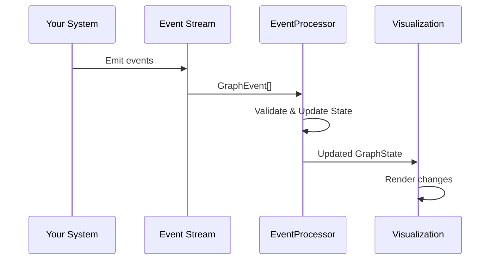
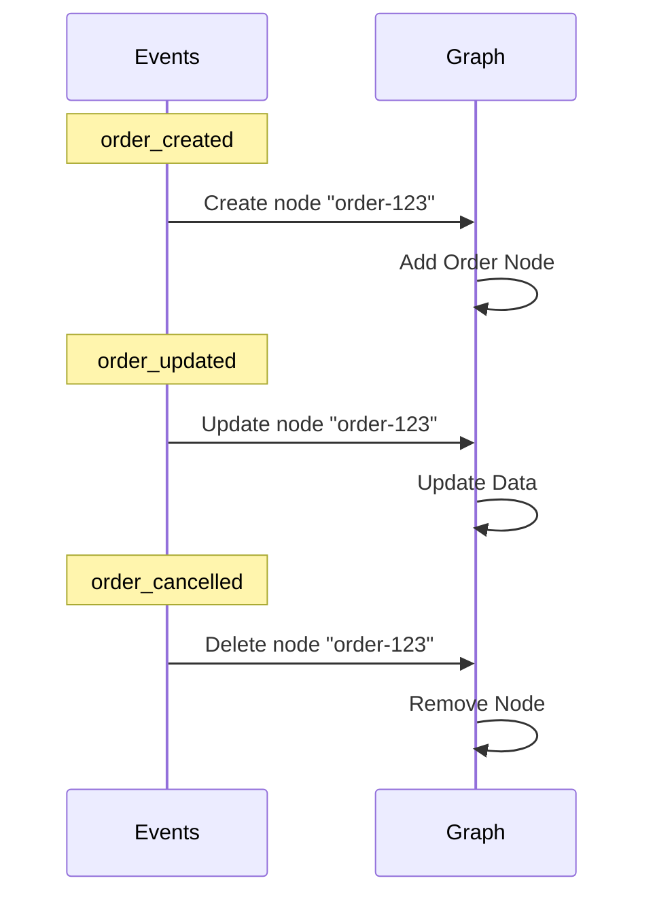
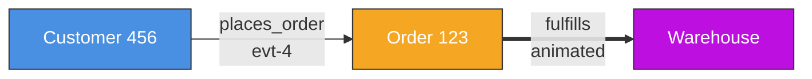
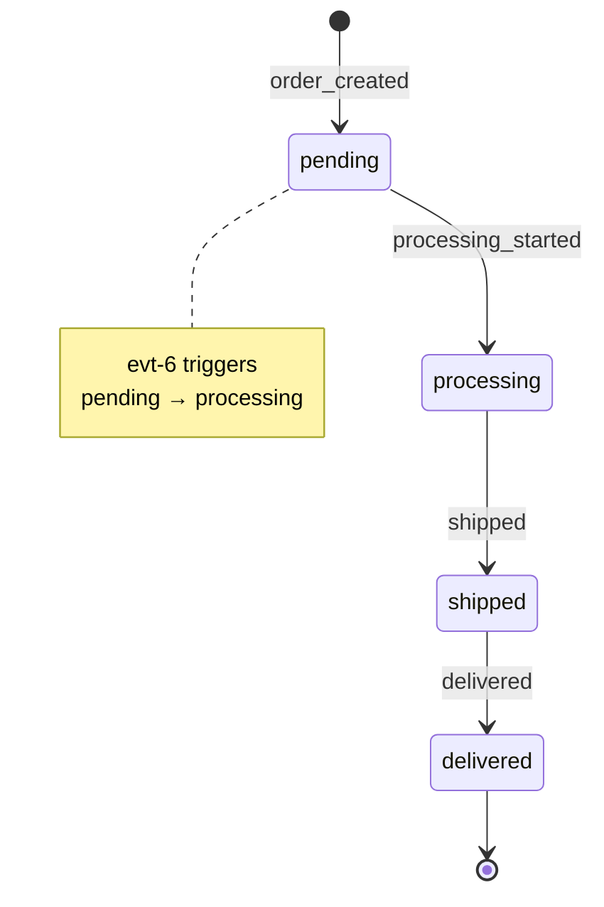
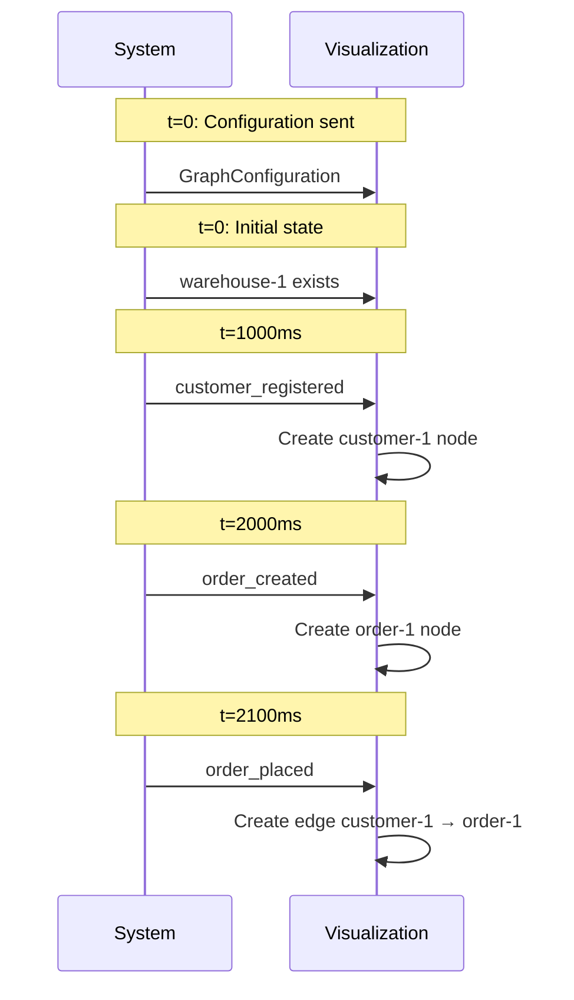
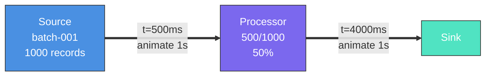

# Event System Guide

The Visual Validation Framework uses an event-driven architecture to update graphs in real-time. This guide explains how events work and how to stream them to your visualization.

## Table of Contents

1. [Overview](#overview)
2. [Event Types](#event-types)
3. [Event Stream Protocol](#event-stream-protocol)
4. [Event Processing](#event-processing)
5. [Examples](#examples)

## Overview

The event system allows you to:
- **Create, update, and delete** nodes and edges dynamically
- **Change node states** to reflect system behavior
- **Animate edges** to show data flow
- **Validate** that events follow expected patterns



## Event Types

All events follow a common structure:

```typescript
interface GraphEvent {
  id: string;           // Unique event ID
  type: string;         // Event type (user-defined)
  timestamp: number;    // When event occurred
  category: 'node' | 'edge' | 'state' | 'data' | 'system';
  operation: 'create' | 'update' | 'delete' | 'animate';
  payload: /* ... */;   // Category-specific payload
  expected?: boolean;   // Whether this was expected
  metadata?: {
    source?: string;
    tags?: string[];
    description?: string;
  };
}
```

### Node Events

Create, update, or delete nodes in the graph.

```typescript
interface NodeEvent {
  operation: 'create' | 'update' | 'delete';
  nodeId: string;
  nodeType: string;
  data?: Record<string, any>;
  position?: { x: number; y: number };
}
```

**Examples:**

```typescript
// Create a new order node
{
  id: "evt-1",
  type: "order_created",
  timestamp: Date.now(),
  category: "node",
  operation: "create",
  payload: {
    operation: "create",
    nodeId: "order-123",
    nodeType: "order",
    data: {
      orderId: "ORD-123",
      amount: 99.99,
      items: ["item1", "item2"]
    },
    position: { x: 100, y: 200 }
  }
}

// Update order data
{
  id: "evt-2",
  type: "order_updated",
  timestamp: Date.now(),
  category: "node",
  operation: "update",
  payload: {
    operation: "update",
    nodeId: "order-123",
    nodeType: "order",
    data: {
      amount: 149.99  // Updated amount
    }
  }
}

// Delete an order
{
  id: "evt-3",
  type: "order_cancelled",
  timestamp: Date.now(),
  category: "node",
  operation: "delete",
  payload: {
    operation: "delete",
    nodeId: "order-123",
    nodeType: "order"
  }
}
```



### Edge Events

Create, update, delete, or animate edges between nodes.

```typescript
interface EdgeEvent {
  operation: 'create' | 'update' | 'delete' | 'animate';
  edgeId: string;
  edgeType: string;
  from: string;
  to: string;
  data?: Record<string, any>;
  animation?: {
    duration?: number;
    direction?: 'forward' | 'backward' | 'bidirectional';
  };
}
```

**Examples:**

```typescript
// Create connection between customer and order
{
  id: "evt-4",
  type: "order_placed",
  timestamp: Date.now(),
  category: "edge",
  operation: "create",
  payload: {
    operation: "create",
    edgeId: "edge-1",
    edgeType: "places_order",
    from: "customer-456",
    to: "order-123",
    data: {
      timestamp: Date.now()
    }
  }
}

// Animate data flow
{
  id: "evt-5",
  type: "data_flow",
  timestamp: Date.now(),
  category: "edge",
  operation: "animate",
  payload: {
    operation: "animate",
    edgeId: "edge-2",
    edgeType: "dataflow",
    from: "processor-1",
    to: "processor-2",
    animation: {
      duration: 1000,
      direction: "forward"
    }
  }
}
```



### State Events

Change the state of a node (e.g., order: pending → processing → shipped).

```typescript
interface StateEvent {
  nodeId: string;
  previousState?: string;
  newState: string;
  data?: Record<string, any>;
}
```

**Example:**

```typescript
// Order state change: pending → processing
{
  id: "evt-6",
  type: "order_processing_started",
  timestamp: Date.now(),
  category: "state",
  operation: "update",
  payload: {
    nodeId: "order-123",
    previousState: "pending",
    newState: "processing",
    data: {
      assignedTo: "warehouse-1"
    }
  }
}
```



### Data Events

Update data on existing nodes or edges without changing structure.

```typescript
interface DataEvent {
  targetId: string;
  targetType: 'node' | 'edge';
  updates: Record<string, any>;
}
```

**Example:**

```typescript
// Update order details
{
  id: "evt-7",
  type: "order_details_updated",
  timestamp: Date.now(),
  category: "data",
  operation: "update",
  payload: {
    targetId: "order-123",
    targetType: "node",
    updates: {
      shippingAddress: "123 Main St",
      estimatedDelivery: "2025-12-01"
    }
  }
}
```

### System Events

Control system-level operations like reset, pause, resume.

```typescript
interface SystemEvent {
  action: 'reset' | 'pause' | 'resume' | 'snapshot';
  data?: any;
}
```

**Examples:**

```typescript
// Reset the entire graph
{
  id: "evt-8",
  type: "system_reset",
  timestamp: Date.now(),
  category: "system",
  operation: "update",
  payload: {
    action: "reset"
  }
}

// Take a snapshot for later replay
{
  id: "evt-9",
  type: "system_snapshot",
  timestamp: Date.now(),
  category: "system",
  operation: "update",
  payload: {
    action: "snapshot",
    data: {
      snapshotId: "snap-1",
      description: "Before deployment"
    }
  }
}
```

## Event Stream Protocol

An event stream is a complete description of a graph visualization session.

```typescript
interface EventStream {
  // Configuration (emitted once at start)
  configuration: GraphConfiguration;

  // Initial graph state (optional)
  initialState?: {
    nodes: Array<{ id: string; type: string; data: any }>;
    edges: Array<{ id: string; type: string; from: string; to: string }>;
  };

  // Stream of events
  events: GraphEvent[];

  // Optional expected events for validation
  expectedEvents?: Array<{
    type: string;
    constraints: Record<string, any>;
    timing?: { minTime: number; maxTime: number };
  }>;
}
```

### Complete Stream Example

```typescript
const stream: EventStream = {
  configuration: {
    metadata: {
      name: "Order Processing",
      version: "1.0.0"
    },
    nodeTypes: { /* ... */ },
    edgeTypes: { /* ... */ },
    allowedConnections: [ /* ... */ ]
  },

  initialState: {
    nodes: [
      { id: "warehouse-1", type: "warehouse", data: { name: "Main Warehouse" } }
    ],
    edges: []
  },

  events: [
    {
      id: "evt-1",
      type: "customer_registered",
      timestamp: 1000,
      category: "node",
      operation: "create",
      payload: {
        operation: "create",
        nodeId: "customer-1",
        nodeType: "customer",
        data: { name: "Alice" }
      }
    },
    {
      id: "evt-2",
      type: "order_created",
      timestamp: 2000,
      category: "node",
      operation: "create",
      payload: {
        operation: "create",
        nodeId: "order-1",
        nodeType: "order",
        data: { amount: 99.99 }
      }
    },
    {
      id: "evt-3",
      type: "order_placed",
      timestamp: 2100,
      category: "edge",
      operation: "create",
      payload: {
        operation: "create",
        edgeId: "edge-1",
        edgeType: "places_order",
        from: "customer-1",
        to: "order-1"
      }
    }
  ],

  expectedEvents: [
    {
      type: "order_created",
      constraints: { nodeType: "order" },
      timing: { minTime: 0, maxTime: 5000 }
    }
  ]
};
```



## Event Processing

The `EventProcessor` class handles event streams:

```typescript
import { EventProcessor } from '@principal-ai/visual-validation-core';

// Create processor with configuration
const processor = new EventProcessor(configuration);

// Process events one at a time
processor.processEvent(event1);
processor.processEvent(event2);

// Or process a batch
processor.processEvents([event1, event2, event3]);

// Get current graph state
const state = processor.getGraphState();
console.log(state.nodes.size); // Number of nodes
console.log(state.edges.size); // Number of edges

// Get event history
const history = processor.getEventHistory();

// Validate the graph
const validation = processor.validate();
console.log(validation.violations); // Any rule violations
```

### React Integration

```typescript
import { useEffect, useState } from 'react';
import { EventProcessor } from '@principal-ai/visual-validation-core';
import { GraphRenderer } from '@principal-ai/visual-validation-react';

function MyVisualization({ configuration, eventStream }) {
  const [processor] = useState(() => new EventProcessor(configuration));
  const [graphState, setGraphState] = useState(processor.getGraphState());

  useEffect(() => {
    // Process events
    eventStream.events.forEach(event => {
      processor.processEvent(event);
    });

    // Update state
    setGraphState(processor.getGraphState());
  }, [eventStream, processor]);

  return (
    <GraphRenderer
      configuration={configuration}
      nodes={Array.from(graphState.nodes.values())}
      edges={Array.from(graphState.edges.values())}
    />
  );
}
```

## Examples

### Example 1: Real-time Order Processing

```typescript
// Simulate order lifecycle
const events = [
  // Customer creates order
  {
    id: "1",
    type: "order_created",
    timestamp: Date.now(),
    category: "node",
    operation: "create",
    payload: {
      operation: "create",
      nodeId: "order-123",
      nodeType: "order",
      data: { amount: 99.99, customerId: "customer-456" }
    }
  },

  // Order state: pending → processing
  {
    id: "2",
    type: "order_processing",
    timestamp: Date.now() + 1000,
    category: "state",
    operation: "update",
    payload: {
      nodeId: "order-123",
      previousState: "pending",
      newState: "processing"
    }
  },

  // Warehouse picks order
  {
    id: "3",
    type: "order_picked",
    timestamp: Date.now() + 5000,
    category: "edge",
    operation: "create",
    payload: {
      operation: "create",
      edgeId: "fulfillment-1",
      edgeType: "fulfills",
      from: "order-123",
      to: "warehouse-1"
    }
  },

  // Order state: processing → shipped
  {
    id: "4",
    type: "order_shipped",
    timestamp: Date.now() + 10000,
    category: "state",
    operation: "update",
    payload: {
      nodeId: "order-123",
      previousState: "processing",
      newState: "shipped"
    }
  }
];
```

```mermaid
gantt
    title Order Processing Timeline
    dateFormat  x
    axisFormat  %Ss

    section Order Lifecycle
    Created (pending)     :0, 1s
    Processing           :1s, 9s
    Shipped              :10s, 5s

    section Events
    order_created        :milestone, 0, 0
    order_processing     :milestone, 1s, 0
    order_picked         :milestone, 5s, 0
    order_shipped        :milestone, 10s, 0
```

### Example 2: Data Pipeline Monitoring

```typescript
// Monitor data flowing through pipeline
const pipelineEvents = [
  // Data enters source
  {
    id: "1",
    type: "data_received",
    timestamp: Date.now(),
    category: "node",
    operation: "create",
    payload: {
      operation: "create",
      nodeId: "batch-001",
      nodeType: "data_batch",
      data: { records: 1000 }
    }
  },

  // Animate flow to processor
  {
    id: "2",
    type: "data_flow",
    timestamp: Date.now() + 500,
    category: "edge",
    operation: "animate",
    payload: {
      operation: "animate",
      edgeId: "pipe-1",
      edgeType: "dataflow",
      from: "source-1",
      to: "processor-1",
      animation: { duration: 1000, direction: "forward" }
    }
  },

  // Update processing stats
  {
    id: "3",
    type: "processing_progress",
    timestamp: Date.now() + 2000,
    category: "data",
    operation: "update",
    payload: {
      targetId: "processor-1",
      targetType: "node",
      updates: {
        processed: 500,
        total: 1000,
        progress: 0.5
      }
    }
  },

  // Complete and flow to sink
  {
    id: "4",
    type: "data_flow",
    timestamp: Date.now() + 4000,
    category: "edge",
    operation: "animate",
    payload: {
      operation: "animate",
      edgeId: "pipe-2",
      edgeType: "dataflow",
      from: "processor-1",
      to: "sink-1",
      animation: { duration: 1000, direction: "forward" }
    }
  }
];
```



## Next Steps

- See [CONFIGURATION.md](./CONFIGURATION.md) to define your graph structure
- See [USAGE.md](./USAGE.md) for integrating with React components
- Check Storybook for interactive examples with live event streams
