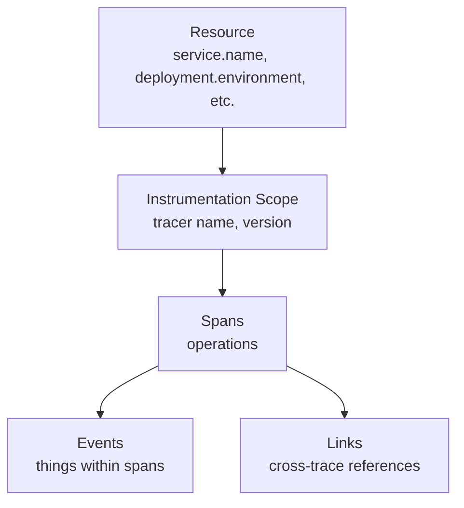
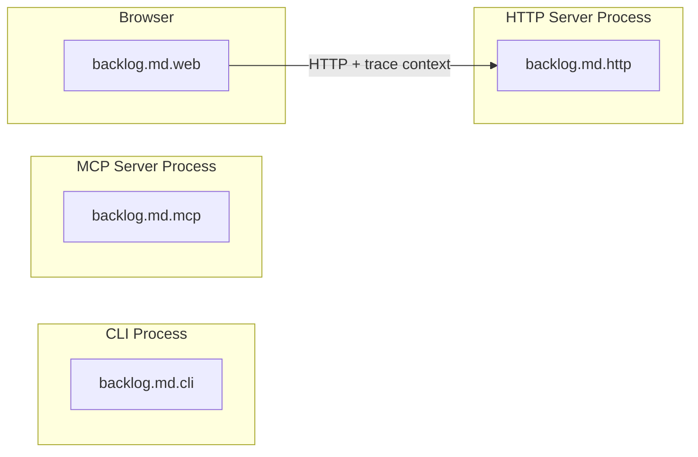
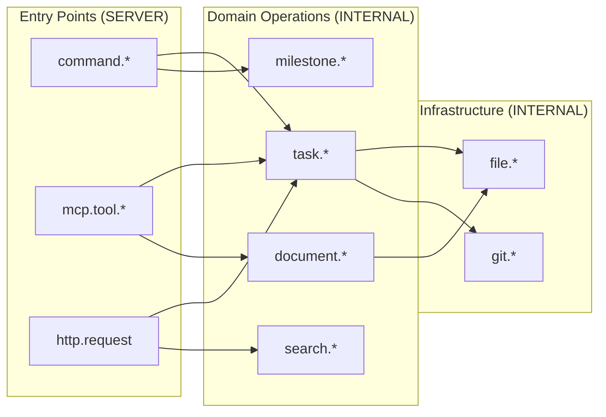
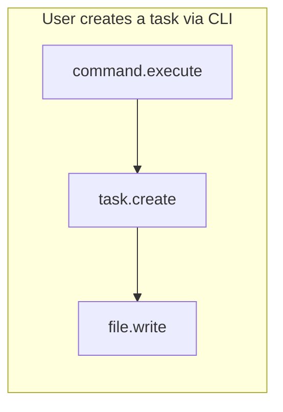
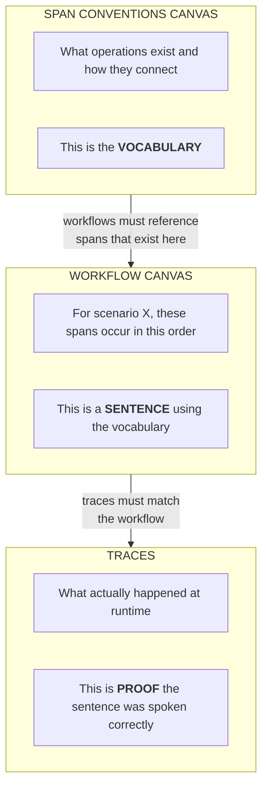
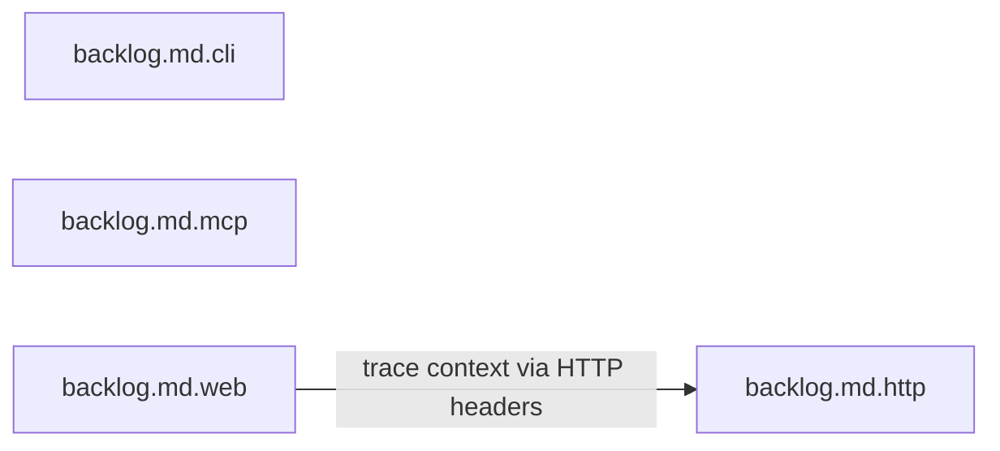
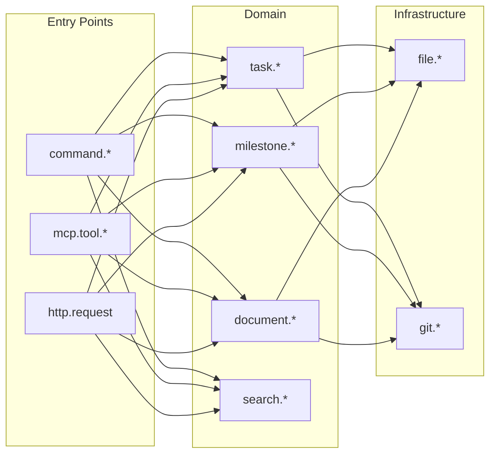

# OpenTelemetry Hierarchy Design

This document outlines the design for modeling OpenTelemetry concepts in Principal View, focusing on resources, scopes, and span conventions.

## OTel Data Model Hierarchy



## Key Concepts

### Resource

A **Resource** represents the entity producing telemetry - typically a service or process.

- Identified by `service.name` (required) and other semantic convention attributes
- One process = one resource
- Separate processes that cannot share trace context should be separate resources
- Browser clients are separate resources from their backend servers

**Key insight:** If two processes cannot propagate trace context between each other (no HTTP calls, no shared context), they should be separate resources. A single "resource" implies traces can flow through it.

**Example:**
```yaml
resources:
  backlog-md-cli:
    service.name: "backlog.md.cli"
    service.version: "${VERSION}"

  backlog-md-mcp:
    service.name: "backlog.md.mcp"
    service.version: "${VERSION}"

  backlog-md-http:
    service.name: "backlog.md.http"
    service.version: "${VERSION}"

  backlog-md-web:
    service.name: "backlog.md.web"
    service.version: "${VERSION}"
```

### Instrumentation Scope

A **Scope** identifies the instrumentation library producing the telemetry.

- Maps to `trace.getTracer("scope-name", "version")` in code
- Should be minimal - one scope per resource is often sufficient
- NOT for differentiating entry points (use span attributes instead)

**When to use multiple scopes:**
| Scenario | Why |
|----------|-----|
| Separate npm packages | `@company/auth`, `@company/payments` - genuinely different libraries |
| Different runtimes | Server vs browser |
| Plugin architecture | Core + plugins developed independently |
| Auto-instrumentation | Wrapping third-party libs |

**When NOT to use multiple scopes:**
- Different modules within same process - use span naming conventions
- Different features - use span names/attributes

**Note:** If entry points run as separate processes (CLI vs HTTP vs MCP), they should be separate *resources*, not scopes. Scopes differentiate instrumentation libraries within a single resource.

**Downsides of scope proliferation:**
1. Implementation overhead (multiple tracer instances)
2. Blurred boundaries (which tracer does shared code use?)
3. Overloading purpose (scopes identify libraries, not call paths)
4. Query complexity
5. Maintenance drift

### Span Conventions

**Spans** represent operations and form the actual architecture of your system. They capture:

- Operation name (e.g., `task.create`, `file.write`)
- Kind (SERVER, CLIENT, INTERNAL, PRODUCER, CONSUMER)
- Attributes (metadata about the operation)
- Parent-child relationships (call hierarchy)

Span conventions define the "vocabulary" of operations your system performs.

## Canvas Types

### 1. Resources Canvas (`resources.canvas`)

Shows resources (processes) and their scopes at the deployment level. Each resource has one or more instrumentation scopes.



Note: CLI, MCP, and HTTP are independent processes with no trace propagation between them. Only the browser client propagates trace context to the HTTP server.

### 2. Span Conventions Canvas (`architecture.spans.canvas`)

Shows the architectural shape of your code - what operations exist and how they relate. Each span convention is a node; edges represent valid parent-child relationships.



Edges are selective — not every entry point calls every domain operation. The canvas captures which span relationships are **valid** in your architecture.

**Node structure:**
```json
{
  "id": "task-operations",
  "pv": {
    "nodeType": "span-convention",
    "description": "Task CRUD operations",
    "otel": {
      "pattern": "task.*",
      "kind": "INTERNAL",
      "layer": "domain",
      "attributes": {
        "task.id": { "type": "string", "required": false },
        "task.title": { "type": "string", "required": true }
      }
    }
  }
}
```

**Edges ARE the validation.** An edge from `command.*` → `task.*` means that parent-child relationship is valid. No edge = invalid. The graph structure itself is the source of truth — no need to duplicate relationships in node metadata.

### 3. Workflow Canvases

Show specific scenarios/user journeys that traverse the architecture.



Workflows use the vocabulary defined in the span conventions canvas.

## Validation Chain



### Validation Levels

| Level | Validates | Error Example |
|-------|-----------|---------------|
| **Workflow → Architecture** | Workflow uses valid spans | "Workflow references `task.archive` but not in span conventions" |
| **Trace → Workflow** | Traces match expected flow | "Expected `file.write` after `task.create` but got `file.read`" |
| **Trace → Architecture** | No rogue spans | "Span `task.foo` observed but not in conventions" |

### CLI Commands

```bash
# Validate span conventions canvas is well-formed
pv validate spans-design

# Validate workflows reference valid span conventions
pv validate workflows --architecture architecture.spans.canvas

# Validate traces match architecture and workflows
pv validate traces --architecture architecture.spans.canvas --workflows ./workflows/
```

## Design-Time Validation

When validating the span conventions canvas:

- [ ] All span patterns have defined parent relationships (no orphans)
- [ ] Naming follows consistent convention (e.g., `domain.operation`)
- [ ] Required attributes are specified
- [ ] Layers are coherent (entry → domain → infra)
- [ ] No circular dependencies

## Runtime Validation

When validating traces against conventions:

- [ ] All observed spans match a documented convention
- [ ] Required attributes are present
- [ ] Parent-child relationships match design
- [ ] No unexpected/undocumented spans

## Example: Backlog.md

### Current State (Incorrect)

```yaml
# library.yaml - wrong: one resource with entry points as scopes
resources:
  backlog-md:
    service.name: "backlog.md"
    owned-scopes:
      - "backlog.md"
      - "backlog.md.cli"    # Separate process, should be resource
      - "backlog.md.mcp"    # Separate process, should be resource
      - "backlog.md.http"   # Separate process, should be resource
      - "backlog.md.tui"    # Part of CLI, not separate
      - "backlog.md.web"    # Separate process (browser), should be resource
```

**Why this is wrong:**
- CLI, MCP server, and HTTP server run as separate processes
- These processes cannot share trace context with each other
- Treating them as one resource implies traces can flow between them (they can't)
- Scopes are for differentiating instrumentation libraries, not processes

### Recommended State

**library.yaml:**
```yaml
resources:
  backlog-md-cli:
    service.name: "backlog.md.cli"
    service.version: "${VERSION}"
    owned-scopes:
      backlog.md.cli:
        description: "CLI command instrumentation"

  backlog-md-mcp:
    service.name: "backlog.md.mcp"
    service.version: "${VERSION}"
    owned-scopes:
      backlog.md.mcp:
        description: "MCP server instrumentation"

  backlog-md-http:
    service.name: "backlog.md.http"
    service.version: "${VERSION}"
    owned-scopes:
      backlog.md.http:
        description: "HTTP server instrumentation"

  backlog-md-web:
    service.name: "backlog.md.web"
    service.version: "${VERSION}"
    owned-scopes:
      backlog.md.web:
        description: "Browser client instrumentation"
```

**Trace propagation:**


Only the browser → HTTP server connection propagates trace context. CLI and MCP are isolated.

**Span conventions (shared across all resources):**

All resources share the same span vocabulary. Each resource emits spans starting from its entry point:



- `backlog.md.cli` traces start at `command.*`
- `backlog.md.mcp` traces start at `mcp.tool.*`
- `backlog.md.http` traces start at `http.request`

**TUI note:** The TUI runs within the CLI process (e.g., `backlog board`), so it's part of `backlog.md.cli`, not a separate resource. Use span attributes to differentiate: `backlog.ui_mode: "tui"` vs `"headless"`.

## Benefits

1. **Design-time safety**: Can't write workflows with invalid span names
2. **Implementation guidance**: Architecture shows what spans to implement
3. **Runtime confirmation**: Traces prove the design is real
4. **Drift detection**: New spans in traces that aren't documented = alert
5. **Clear mental model**: Resources (processes) → Scopes (libraries) → Spans (operations)
6. **Accurate trace boundaries**: Resources align with actual process boundaries, so trace propagation expectations are correct
