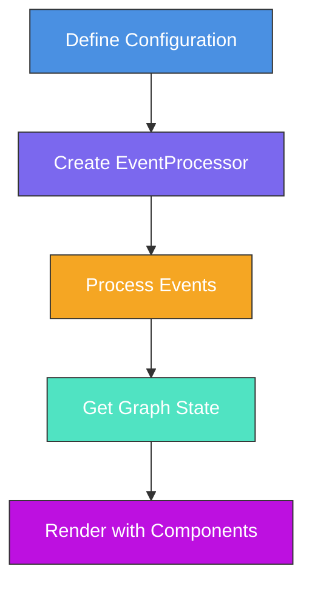
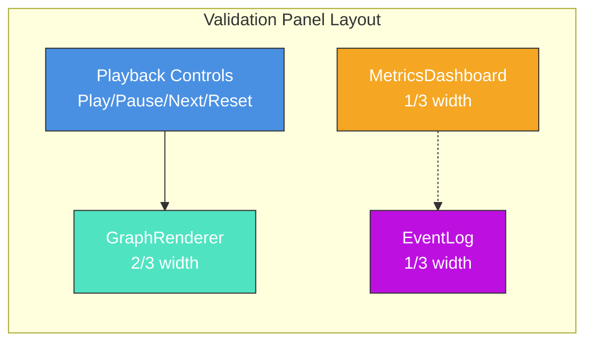
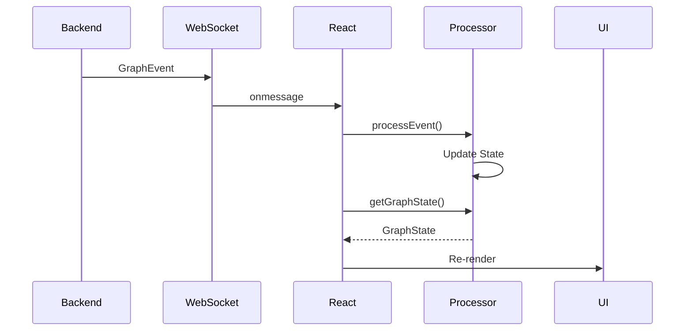
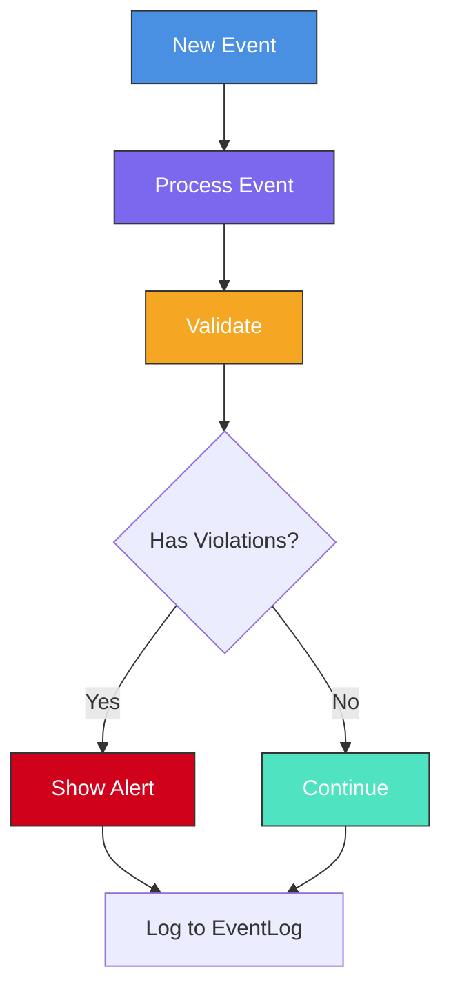

# Usage Guide

This guide shows how to use the Visual Validation React components to build graph visualization applications.

## Table of Contents

1. [Installation](#installation)
2. [Quick Start](#quick-start)
3. [Components](#components)
4. [Building a Complete Panel](#building-a-complete-panel)
5. [Advanced Patterns](#advanced-patterns)

## Installation

```bash
npm install @principal-ai/visual-validation-react @principal-ai/visual-validation-core
# or
bun add @principal-ai/visual-validation-react @principal-ai/visual-validation-core
```

### Peer Dependencies

```bash
npm install react react-dom
```

## Quick Start

Here's a minimal example to get started:

```typescript
import React from 'react';
import { EventProcessor } from '@principal-ai/visual-validation-core';
import { GraphRenderer } from '@principal-ai/visual-validation-react';
import type { GraphConfiguration } from '@principal-ai/visual-validation-core';

// Define your configuration
const config: GraphConfiguration = {
  metadata: {
    name: 'My System',
    version: '1.0.0',
  },
  nodeTypes: {
    process: {
      shape: 'rectangle',
      color: '#4A90E2',
      dataSchema: {
        name: { type: 'string', required: true, displayInLabel: true },
      },
    },
  },
  edgeTypes: {
    dataflow: {
      style: 'solid',
      color: '#999999',
    },
  },
  allowedConnections: [{ from: 'process', to: 'process', via: 'dataflow' }],
};

function App() {
  const processor = new EventProcessor(config);
  const state = processor.getGraphState();

  return (
    <GraphRenderer
      configuration={config}
      nodes={Array.from(state.nodes.values())}
      edges={Array.from(state.edges.values())}
      width="100%"
      height="600px"
    />
  );
}
```



## Components

### GraphRenderer

The main component for visualizing graphs.

```typescript
import { GraphRenderer } from '@principal-ai/visual-validation-react';

<GraphRenderer
  configuration={config}
  nodes={nodes}
  edges={edges}
  className="my-graph"
  width={800}
  height={600}
/>;
```

**Props:**

| Prop            | Type                 | Required | Description                                  |
| --------------- | -------------------- | -------- | -------------------------------------------- |
| `configuration` | `GraphConfiguration` | Yes      | Graph configuration defining types and rules |
| `nodes`         | `NodeState[]`        | Yes      | Array of nodes to display                    |
| `edges`         | `EdgeState[]`        | Yes      | Array of edges to display                    |
| `className`     | `string`             | No       | CSS class name                               |
| `width`         | `number \| string`   | No       | Width (default: `100%`)                      |
| `height`        | `number \| string`   | No       | Height (default: `100%`)                     |

### EventLog

Display a log of graph events.

```typescript
import { EventLog } from '@principal-ai/visual-validation-react';

<EventLog
  events={events}
  violations={violations}
  onEventClick={(event) => console.log('Clicked:', event)}
  maxHeight="400px"
/>;
```

**Props:**

| Prop           | Type                          | Required | Description                    |
| -------------- | ----------------------------- | -------- | ------------------------------ |
| `events`       | `GraphEvent[]`                | Yes      | Array of events to display     |
| `violations`   | `Violation[]`                 | No       | Violations to highlight        |
| `onEventClick` | `(event: GraphEvent) => void` | No       | Callback when event is clicked |
| `className`    | `string`                      | No       | CSS class name                 |
| `maxHeight`    | `number \| string`            | No       | Max height (default: `400px`)  |

### MetricsDashboard

Show metrics about your graph.

```typescript
import { MetricsDashboard } from '@principal-ai/visual-validation-react';

<MetricsDashboard metrics={metrics} className="metrics" />;
```

**Props:**

| Prop        | Type           | Required | Description                                                 |
| ----------- | -------------- | -------- | ----------------------------------------------------------- |
| `metrics`   | `GraphMetrics` | Yes      | Metrics object with node, edge, event, and validation stats |
| `className` | `string`       | No       | CSS class name                                              |

## Building a Complete Panel

Combine components to create a full visualization panel:

```typescript
import React, { useState, useEffect } from 'react';
import { GraphRenderer, EventLog, MetricsDashboard } from '@principal-ai/visual-validation-react';
import { EventProcessor } from '@principal-ai/visual-validation-core';
import type {
  GraphConfiguration,
  GraphEvent,
  EventStream,
} from '@principal-ai/visual-validation-core';

interface PanelProps {
  configuration: GraphConfiguration;
  eventStream: EventStream;
}

function ValidationPanel({ configuration, eventStream }: PanelProps) {
  // Create processor
  const [processor] = useState(() => new EventProcessor(configuration));

  // State management
  const [graphState, setGraphState] = useState(processor.getGraphState());
  const [events, setEvents] = useState<GraphEvent[]>([]);
  const [currentEventIndex, setCurrentEventIndex] = useState(0);

  // Process initial state
  useEffect(() => {
    if (eventStream.initialState) {
      // Process initial nodes and edges
      eventStream.initialState.nodes.forEach((node) => {
        processor.processEvent({
          id: `init-node-${node.id}`,
          type: 'initial_node',
          timestamp: 0,
          category: 'node',
          operation: 'create',
          payload: {
            operation: 'create',
            nodeId: node.id,
            nodeType: node.type,
            data: node.data,
          },
        });
      });
    }
  }, [eventStream, processor]);

  // Process next event
  const processNextEvent = () => {
    if (currentEventIndex < eventStream.events.length) {
      const event = eventStream.events[currentEventIndex];
      processor.processEvent(event);
      setEvents((prev) => [...prev, event]);
      setGraphState(processor.getGraphState());
      setCurrentEventIndex((prev) => prev + 1);
    }
  };

  // Auto-play events
  const [isPlaying, setIsPlaying] = useState(false);
  useEffect(() => {
    if (isPlaying && currentEventIndex < eventStream.events.length) {
      const timer = setTimeout(processNextEvent, 1000);
      return () => clearTimeout(timer);
    } else if (currentEventIndex >= eventStream.events.length) {
      setIsPlaying(false);
    }
  }, [isPlaying, currentEventIndex]);

  // Get validation results
  const validation = processor.validate();

  // Calculate metrics
  const metrics = {
    nodes: {
      total: graphState.nodes.size,
      byType: Array.from(graphState.nodes.values()).reduce((acc, node) => {
        acc[node.type] = (acc[node.type] || 0) + 1;
        return acc;
      }, {} as Record<string, number>),
      byState: {},
    },
    edges: {
      total: graphState.edges.size,
      byType: Array.from(graphState.edges.values()).reduce((acc, edge) => {
        acc[edge.type] = (acc[edge.type] || 0) + 1;
        return acc;
      }, {} as Record<string, number>),
    },
    events: {
      total: events.length,
      byCategory: events.reduce((acc, evt) => {
        acc[evt.category] = (acc[evt.category] || 0) + 1;
        return acc;
      }, {} as Record<string, number>),
      byType: events.reduce((acc, evt) => {
        acc[evt.type] = (acc[evt.type] || 0) + 1;
        return acc;
      }, {} as Record<string, number>),
      rate: events.length / Math.max(1, currentEventIndex),
    },
    validation: {
      violations: validation.violations.length,
      warnings: validation.warnings.length,
      unexpectedEvents: validation.metrics.unexpectedEvents,
      healthScore: 1 - validation.violations.length / Math.max(1, events.length),
    },
    performance: {
      renderTime: 0,
      eventProcessingTime: 0,
      layoutTime: 0,
    },
  };

  return (
    <div
      style={{
        display: 'grid',
        gridTemplateColumns: '2fr 1fr',
        height: '100vh',
        gap: '16px',
        padding: '16px',
      }}
    >
      {/* Left column: Graph */}
      <div style={{ display: 'flex', flexDirection: 'column', gap: '16px' }}>
        <div style={{ display: 'flex', gap: '8px', alignItems: 'center' }}>
          <button onClick={() => setIsPlaying(!isPlaying)}>{isPlaying ? 'Pause' : 'Play'}</button>
          <button
            onClick={processNextEvent}
            disabled={currentEventIndex >= eventStream.events.length}
          >
            Next Event
          </button>
          <button
            onClick={() => {
              processor.reset();
              setEvents([]);
              setCurrentEventIndex(0);
              setGraphState(processor.getGraphState());
            }}
          >
            Reset
          </button>
          <span>
            Event {currentEventIndex} / {eventStream.events.length}
          </span>
        </div>

        <GraphRenderer
          configuration={configuration}
          nodes={Array.from(graphState.nodes.values())}
          edges={Array.from(graphState.edges.values())}
          width="100%"
          height="100%"
        />
      </div>

      {/* Right column: Metrics and Events */}
      <div style={{ display: 'flex', flexDirection: 'column', gap: '16px', overflow: 'hidden' }}>
        <MetricsDashboard metrics={metrics} />
        <EventLog
          events={events}
          violations={validation.violations}
          onEventClick={(event) => console.log('Event clicked:', event)}
        />
      </div>
    </div>
  );
}

export default ValidationPanel;
```



## Advanced Patterns

### Real-time Event Streaming

Stream events from a WebSocket or Server-Sent Events:

```typescript
import { useEffect } from 'react';

function LiveVisualization({ configuration }: { configuration: GraphConfiguration }) {
  const [processor] = useState(() => new EventProcessor(configuration));
  const [graphState, setGraphState] = useState(processor.getGraphState());

  useEffect(() => {
    // Connect to event stream
    const ws = new WebSocket('ws://localhost:8080/events');

    ws.onmessage = (message) => {
      const event: GraphEvent = JSON.parse(message.data);

      // Process event
      processor.processEvent(event);

      // Update visualization
      setGraphState(processor.getGraphState());
    };

    return () => ws.close();
  }, [processor]);

  return (
    <GraphRenderer
      configuration={configuration}
      nodes={Array.from(graphState.nodes.values())}
      edges={Array.from(graphState.edges.values())}
    />
  );
}
```



### Time Travel / Replay

Implement event replay with time controls:

```typescript
function ReplayPanel({ configuration, eventStream }: PanelProps) {
  const [processor] = useState(() => new EventProcessor(configuration));
  const [timeline, setTimeline] = useState(0);

  // Jump to specific point in timeline
  const jumpTo = (eventIndex: number) => {
    processor.reset();

    // Replay events up to index
    for (let i = 0; i < eventIndex; i++) {
      processor.processEvent(eventStream.events[i]);
    }

    setTimeline(eventIndex);
  };

  return (
    <div>
      <input
        type="range"
        min={0}
        max={eventStream.events.length}
        value={timeline}
        onChange={(e) => jumpTo(parseInt(e.target.value))}
      />
      <GraphRenderer
        configuration={configuration}
        nodes={Array.from(processor.getGraphState().nodes.values())}
        edges={Array.from(processor.getGraphState().edges.values())}
      />
    </div>
  );
}
```

### Event Filtering

Filter events by type or category:

```typescript
function FilteredEventLog({ events }: { events: GraphEvent[] }) {
  const [filter, setFilter] = useState<string | null>(null);
  const [categoryFilter, setCategoryFilter] = useState<string | null>(null);

  const filteredEvents = events.filter((event) => {
    if (filter && event.type !== filter) return false;
    if (categoryFilter && event.category !== categoryFilter) return false;
    return true;
  });

  return (
    <div>
      <select onChange={(e) => setCategoryFilter(e.target.value || null)}>
        <option value="">All Categories</option>
        <option value="node">Node Events</option>
        <option value="edge">Edge Events</option>
        <option value="state">State Events</option>
        <option value="data">Data Events</option>
        <option value="system">System Events</option>
      </select>

      <EventLog events={filteredEvents} />
    </div>
  );
}
```

### Custom Node Rendering

Extend the default node renderer:

```typescript
import { GenericNode } from '@principal-ai/visual-validation-react';

function CustomOrderNode({ data, nodeType }: { data: any; nodeType: any }) {
  return (
    <div
      style={{
        padding: '12px',
        backgroundColor: nodeType.color,
        borderRadius: '8px',
        color: 'white',
      }}
    >
      <div style={{ fontWeight: 'bold' }}>Order {data.orderId}</div>
      <div>${data.amount}</div>
      <div>{data.items?.length} items</div>
    </div>
  );
}

// Use in configuration or as override
```

### Validation Alerts

Show real-time validation warnings:

```typescript
function ValidationAlertsPanel({ processor }: { processor: EventProcessor }) {
  const [validation, setValidation] = useState(processor.validate());

  useEffect(() => {
    // Re-validate on each event
    const interval = setInterval(() => {
      setValidation(processor.validate());
    }, 1000);

    return () => clearInterval(interval);
  }, [processor]);

  return (
    <div>
      {validation.violations.map((violation) => (
        <div
          key={violation.id}
          style={{
            padding: '8px',
            margin: '4px',
            backgroundColor: violation.severity === 'error' ? '#D0021B' : '#F5A623',
            color: 'white',
            borderRadius: '4px',
          }}
        >
          <strong>{violation.type}</strong>: {violation.description}
          {violation.context?.nodeId && <div>Node: {violation.context.nodeId}</div>}
        </div>
      ))}
    </div>
  );
}
```



## Next Steps

- See [CONFIGURATION.md](./CONFIGURATION.md) for configuration details
- See [EVENT_SYSTEM.md](./EVENT_SYSTEM.md) for event system details
- Check the Storybook for interactive examples
- Look at the TypeScript types for complete API documentation
