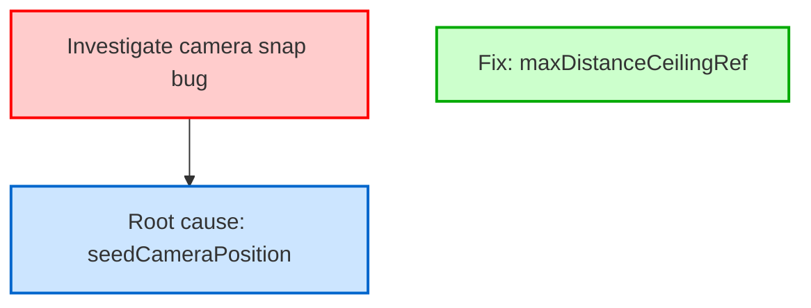
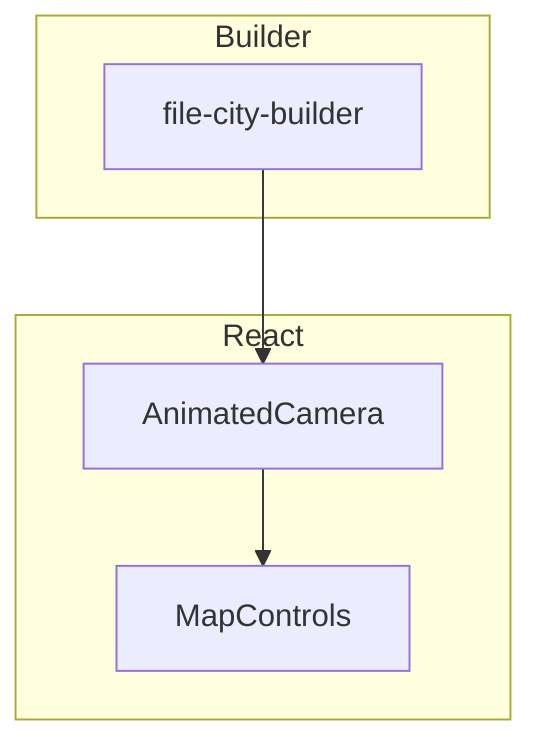
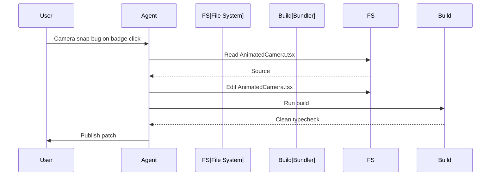

# Create Session Decisions Skill

Analyze an opencode agent session, extract the technical decisions made, generate mermaid diagrams, and show the result as a local Principal View topic via the desktop app bridge.

## Purpose

This skill answers the question: **"What technical decisions did this agent session produce, and how do they relate to each other?**"

It transforms a raw agent session (a sequence of messages, tool calls, and file edits) into a structured topic containing:
- **Decision records** — each significant technical choice as a top-level `##` header with rationale, alternatives considered, and outcome
- **Table of contents** — markdown links to each decision header
- **Mermaid diagrams** — visual representations of decision flows, component relationships, and execution timelines with category-based colors
- **File references** — links back to specific files and line ranges touched during the session
- **Confidence and status** — how certain the agent was, and whether the decision was finalized or is still pending

## When to Use This Skill

Use this skill when the user wants to:
- **Review agent decisions** — "What did this agent actually decide and why?"
- **Create decision documentation** — "Turn this session into a readable decision log"
- **Visualize architecture choices** — "Show me the component relationships this session established"
- **Prototype Principal AI** — "Automatically summarize an agent session as a Principal View topic"
- **Onboard from agent work** — "I want to understand the technical choices made in this session before I review the code"

## Prerequisites

- An opencode session ID (from `principal-ai opencode list-sessions`)
- The opencode SQLite database accessible at the default XDG path or via `--db-path`
- The Principal desktop app running locally (bridge at `http://localhost:3044`)
- Optional: A Principal View account (for publishing topics to web-ade from the app UI)

## Session Event Model

When using the normalized `agent-session fetch` path, you work with `RepoNormalizedUniversalAgentSessionEvent`s. The `eventType` field classifies each event; the ones most relevant to decision extraction:

| eventType | What it contains | Role in decision extraction |
|---|---|---|
| `session-start` | Session metadata: title, agent, model, directory | Session context identifying fields |
| `message-display` | Message envelope: agent, parentID, tokens, messageID | Correlate assistant turns |
| `notification` | Prose text (`data.message`), messageID | **Primary source of assistant/user prose** |
| `pre-tool-use` / `tool-executing` / `post-tool-use` / `post-tool-use-failure` | Tool call lifecycle (name, input, output, callID) | Reveal planned tool sequences that form decisions |
| `file-changed` | `files[]` with repo-relative `displayPath` | Link decisions to the exact files modified |
| `step-start` / `step-finish` | Model thinking-step boundaries (reason, cost, tokens) | Step boundaries that scope each decision |
| `user-prompt-submit` | `data.prompt` (hist) | Task framing at the start or turns |

Key extraction rules:
- **Prose** lives at `notification.data.message` (not `data.text`).
- **File references** are at `file-changed.files[].displayPath` — already repo-relative and stable (e.g. `packages/react/src/FileCity3D.tsx`), so they can be referenced directly in the topic.
- Every event carries `sessionId`, `workingDirectory`, and `timestamp` (ms epoch).

The **raw opencode-only path** (back-compat) works with opencode's event stream instead:
- `session.created.1` / `session.updated.1` — session metadata
- `message.updated.1` — message envelope: role, author, timestamp
- `message.part.updated.1` — content parts: `text`, `reasoning`, `tool`, `step-start`

Under that path, message parts have a `type` field:
- `text` — assistant or user prose
- `reasoning` — internal agent reasoning
- `tool` — tool call input/output (usually empty string for calls, JSON for results)
- `step-start` — step boundary marker

## Workflow

### Phase 1: Discover and Fetch the Session

Prefer the unified **`agent-session`** command group, which reads **all supported agents (Cline + opencode)** and normalizes raw events into repo-aware universal events.

1. **List available sessions** across all agents:

   ```bash
   principal-ai agent-session list
   ```

   Output is a JSON array with per-session `{ agent, sessionId, title, createdAt, eventCount, isFinished }`. The `agent` field tells you whether the session came from Cline or opencode.

   > **Top-level only by default.** The list excludes subagent sessions (e.g. opencode `@explore`/`@build` task-spawned children). Sessions are returned newest-first by created date. Prefer to review top-level sessions — they carry the full decision arc; subagent sessions are narrow explorations.

2. **Fetch the full session and normalize it**:

   ```bash
   principal-ai agent-session fetch <session-id> > session.json
   ```

   Auto-detects the agent (or force it with `--agent cline|opencode`). Output shape:

   ```json
   {
     "agent": "opencode",
     "sessionId": "ses_...",
     "normalized": [ "RepoNormalizedUniversalAgentSessionEvent..." ],
     "accumulated": [ "...accumulated session state per event..." ]
   }
   ```

   The `normalized` array is **repo-normalized**: every file reference is resolved to a stable, repo-relative path (e.g. `packages/react/src/FileCity3D.tsx`) with attached repository metadata. Decisions extracted from this are consistently linkable across sessions.

   Useful flags:
   - `--raw` — return the pre-normalization `UniversalAgentSessionEvent[]` instead
   - `--agent cline|opencode` — skip auto-detection
   - `--db-path <path>` — point at a specific opencode.db

3. **Extract the session metadata** from the `normalized` events (they carry session context):

   - `eventType: "session-start"` — title/model/directory from `data`
   - `sessionId`, `workingDirectory` — on every event
   - `timestamp` — start time (ms epoch)

### Back-compat: raw opencode-only path

If `agent-session` is unavailable, fall back to the opencode-only raw path:

```bash
principal-ai opencode list-sessions --limit 20
principal-ai opencode fetch <session-id> --limit 10000 > session.json
```

Then read the raw `message.part.updated.1` events as documented in the Session Event Model section. Prefer the normalized path whenever possible.

### Phase 2: Analyze for Technical Decisions

Read through the normalized events in order (sorted by `timestamp`). For the normalized path, the assistant/user **prose** lives on `notification` events at `data.message`. Walk these chronologically alongside the `pre-tool-use`/`post-tool-use` and `file-changed` events to reconstruct what the agent decided and did. For each significant assistant message, ask:

**Is this a technical decision?**
Look for signals like:
- Explicit choices: "We will use X", "I will go with Y", "Instead of Z..."
- Trade-off reasoning: "X is faster but Y is simpler..."
- Architecture patterns: "Let us structure this as...", "We should extract..."
- Tool call sequences that reveal a plan: read file, edit file, run test
- Revisions: "Actually, let us reconsider..."
- Final summaries: "Here is what I built..."

**Do NOT extract:**
- Pure file listings or directory explorations without interpretation
- Simple acknowledgments ("OK", "Sure")
- Error messages that were not recovered from
- Repeated identical outputs

For each decision, record:

```json
{
  "seq": 42,
  "timestamp": 1785251893200,
  "category": "architecture|data-model|api-design|tooling|error-handling|testing|deployment",
  "decision": "Use SQLite instead of PostgreSQL for the session store",
  "rationale": "Simpler deployment, single-file, no separate process needed",
  "alternatives": ["PostgreSQL", "JSON files"],
  "outcome": "adopted",
  "confidence": "high|medium|low",
  "filesTouched": ["packages/core/src/opencode/OpenCodeEventStore.ts"],
  "relatedDecisions": ["seq-38"]
}
```

### Phase 3: Build the Topic Description

Construct a markdown document with these sections:

#### Title

`Principal Review <review-date> — <session-title>`

The `<review-date>` is the local date of the review/session (e.g. `2026-08-03`), placed directly after "Principal Review" so reviews sort and scan by date.

#### Decision Log

For each decision, create a subsection:

```markdown
### Decision <N>: <short-title>

**Category:** architecture  
**Confidence:** high  
**Timestamp:** <ISO-timestamp>

**Decision:**  
<one-sentence statement of the choice>

**Rationale:**  
<why the agent chose this>

**Alternatives considered:**  
- Alternative A — rejected because...
- Alternative B — rejected because...

**Outcome:** adopted / superseded / pending

**Files touched:**  
- `path/to/file.ts` (lines 12–45)
- `path/to/other.ts` (full file)
```

#### Mermaid Diagrams

Include the following diagram types:

1. **Decision Flow** — `graph TD` showing how decisions relate to each other

   ```mermaid
   graph TD
     D1["Use SQLite for session store"]
     D2["Schema: events table with aggregate_id"]
     D3["Index on seq for pagination"]
     D1 --> D2
     D2 --> D3
   ```

   Nodes are decision IDs. Edges show "led to" or "depends on".

2. **Component Relationship** — `graph TB` showing files/components introduced or modified

   ```mermaid
   graph TB
     subgraph Core
       Store[OpenCodeEventStore]
       Types[OpenCodeRawEvent]
     end
     subgraph CLI
       Fetch[opencode fetch]
       List[opencode list-sessions]
     end
     Fetch --> Store
     List --> Store
     Store --> Types
   ```

3. **Timeline** — `sequenceDiagram` showing the chronological flow of decisions

   ```mermaid
   sequenceDiagram
     participant User
     participant Agent
     participant DB
     User->>Agent: Explore project structure
     Agent->>DB: Read session events
     DB-->>Agent: Return event stream
     Agent->>Agent: Identify decisions
     Agent->>User: Publish topic
   ```

#### References

```markdown
## References

- Session: `<session-id>`
- Repositories:
  - `principal-ai/principal-view-core-library` (main @ `7fcec106`)
- Primary files:
  - `packages/core/src/opencode/OpenCodeEventStore.ts`
  - `packages/cli/src/commands/agent-session.ts`
```

#### Session Metadata

End every review with the session metadata block (put it at the bottom, not the top, so readers hit the content first):

```markdown
## Session Metadata

**Agent:** `<agent-name>`  
**Session:** `<session-id>`  
**Parent session:** `<parent-id>` (if it is a subagent)  
**Working directory:** `<working-directory>`  
**Review date:** `<ISO-date>`  
**Events:** <N>
```

> **Repositories:** `agent-session fetch` returns a `repos` array at the top of the output — each entry has `{ owner, repo, branch, headCommit, remoteUrl, root }`. Include these in the topic's References section so readers know exactly which repos (and commits) the session's decisions touch. Repos and the metadata block both live near the end of the document.

### Phase 4: Create the Topic Through the Bridge

Create the topic by POSTing to the running desktop app's MCP bridge. This makes the topic appear immediately in the app's Topics surface — no file writes, no index reload, no restart needed.

Use the existing **`create-topic`** skill to perform the bridge call. That skill owns the `POST /api/topics` contract; this skill only needs to prepare the payload.

#### Step A: Prepare the payload

Map the `repos` array from `agent-session fetch` into PURL strings, then build the payload:

```json
{
  "title": "Principal Review <review-date> — <session-title>",
  "description": <the markdown built in Phase 3>,
  "trailIds": [],
  "repos": ["pkg:github/principal-ai/principal-view-core-library"]
}
```

Notes:
- `title` is required and non-empty.
- `description` is markdown and can include mermaid diagrams.
- `trailIds` are local trail ids if you want to bundle existing trails; omit or pass `[]` for a fresh topic.
- `repos` are optional PURL strings (`pkg:github/owner/repo`). Derive them from `agent-session fetch`'s `repos` array: for each entry with `owner` and `repo`, push `pkg:github/<owner>/<repo>`. This attaches the repos to the topic so they can be resolved/opened from the desktop app.

#### Step B: Call the bridge

```bash
curl -s -X POST http://localhost:3044/api/topics   -H 'content-type: application/json'   -d '<payload-from-Step-A>'
```

Expected success response:

```json
{
  "success": true,
  "topic": {
    "id": "<new-topic-id>",
    "title": "Principal Review <review-date> — <session-title>",
    "description": "...",
    "trailIds": [],
    "createdAt": "...",
    "updatedAt": "..."
  },
  "trails": []
}
```

Capture the returned `topic.id`. The topic is now visible in the desktop app.

#### Step C: Optional — Validate references

If the description contains file references, validate them:

```bash
curl -s -X POST http://localhost:3044/api/topics/<topic-id>/validate-links | jq
```

Fix any errors (malformed purls, missing files) and re-validate before handing off.

### Phase 5: Optional — Publish to web-ade

Publishing is a human action in the app UI. If the user wants to share the topic, tell them to publish from there. The bridge does **not** publish to web-ade.

If you need a web-ade topic from the CLI instead:

```bash
principal-ai topic create   --title "Principal Review <review-date> — <session-title>"   --description "<the markdown built in Phase 3>"
```

Then attach the session trail if one exists:

```bash
principal-ai topic add-trail <published-topic-id> <trail-id>
```

For local-only sessions, note the session ID in the topic description and skip this step.

## Topic Description Template

Use this template as the starting point for the description:

```markdown
# Principal Review <review-date> — <session-title>

## Table of Contents

- [Decision 1: <short-title>](#decision-1)
- [Decision 2: <short-title>](#decision-2)
- [Decision 3: <short-title>](#decision-3)

## Decision 1: <short-title>

**Category:** <category>  
**Confidence:** <confidence>  
**Timestamp:** <ISO-timestamp>

**Decision:**  
<one-sentence statement>

**Rationale:**  
<why>

**Alternatives considered:**  
- <alternative> — <reason rejected>

**Outcome:** <adopted|superseded|pending>

**Files touched:**  
- `<file>` (lines <range>)

## Decision 2: <short-title>

**Category:** <category>  
**Confidence:** <confidence>  
**Timestamp:** <ISO-timestamp>

**Decision:**  
<one-sentence statement>

**Rationale:**  
<why>

**Alternatives considered:**  
- <alternative> — <reason rejected>

**Outcome:** <adopted|superseded|pending>

**Files touched:**  
- `<file>` (lines <range>)

## Decision Flow



## Component Relationships



## Execution Timeline



## References

- Session ID: `<session-id>`
- Primary packages:
  - `@principal-ai/file-city-react`
  - `@principal-ai/file-city-builder`

## Session Metadata

**Agent:** `<agent-name>`  
**Session:** `<session-id>`  
**Parent session:** `<parent-id>` (if subagent)  
**Working directory:** `<working-directory>`  
**Review date:** `<review-date>`  
**Events:** <N>
```
## File Organization

**Local topics** are stored at:

```
~/.principal/topics/
  topic-<timestamp>-<random>.json
  _index.json
```

**Published topics** live on web-ade and are accessed via:

```
https://app.principal-ade.com/topic/<uuid>
```

## Common Pitfalls

### Don't: Extract every file read as a decision

Reading a file is exploration, not a decision. Only extract choices where the agent explicitly selected one approach over another.

### Don't: Generate diagrams with more than ~15 nodes

Mermaid diagrams become unreadable beyond ~15 nodes. If a session has more decisions, split into multiple topics or group related decisions.

### Don't: Include raw tool call JSON in the description

Summarize tool calls in prose. Raw JSON bloats the topic and is hard to read.

### Don't: Omit the rationale

A decision without rationale is useless. Always capture why the agent chose this path.

### Do: Link to files with line ranges

When possible, include `path/to/file.ts` (lines 42–88) so readers can jump directly to the relevant code.

## Type Definitions Reference

For the topic shapes, see:
- `packages/core/src/storage/topic-types.ts` — `DraftTopic`, `TopicStatus`, `TopicAsset`
- `packages/core/src/storage/topicStore.ts` — `TopicStore`, `TopicCreate`, `TopicUpdate`
- `packages/cli/src/commands/topic.ts` — CLI for creating and managing topics on web-ade

For the session shapes, see:
- `packages/core/src/opencode/types.ts` — `OpenCodeRawEvent`, `OpenCodeSessionEvents`, `SessionSummary`
- `packages/core/src/opencode/OpenCodeEventStore.ts` — reads from SQLite
- `packages/cli/src/commands/opencode/fetch.ts` — CLI fetch command
